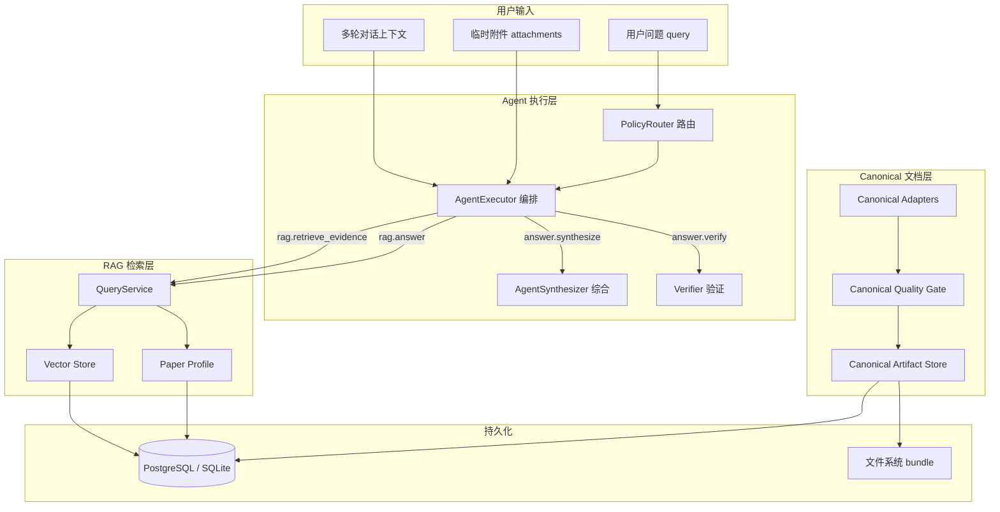
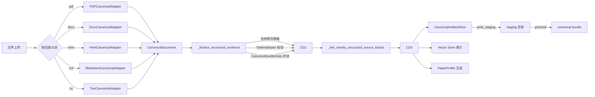
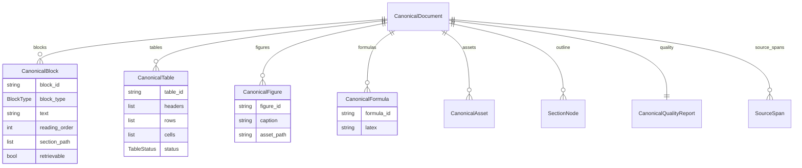
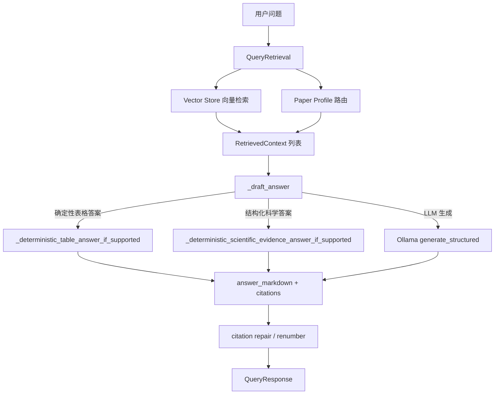
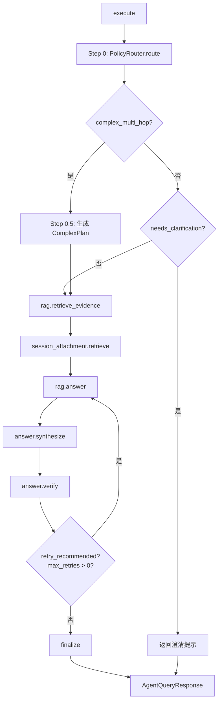
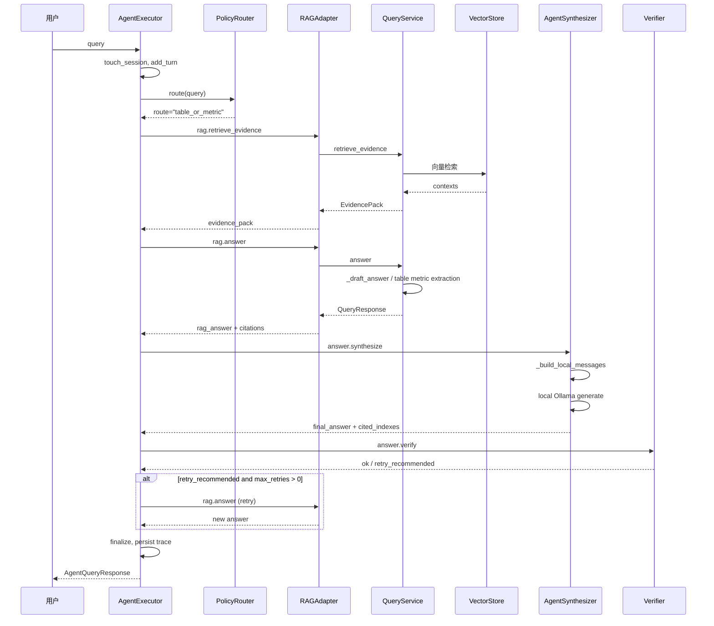

# Knowledge Agent 系统架构与查询流程详解

> 本文档描述 `internal-pilot` 分支下 Agent + RAG + Canonical 三层架构的整体流程、关键模块职责与数据流转。
> 生成日期：2026-07-29

---

## 目录

1. [总体架构概览](#总体架构概览)
2. [数据 ingestion 流程](#数据-ingestion-流程)
3. [Canonical 文档层](#canonical-文档层)
4. [检索层（RAG）](#检索层rag)
5. [Agent 执行层](#agent-执行层)
6. [单次查询完整生命周期](#单次查询完整生命周期)
7. [模块索引](#模块索引)
8. [关键设计决策](#关键设计决策)

---

## 总体架构概览



### 三层职责划分

| 层级 | 主要职责 | 核心文件 |
|---|---|---|
| **Canonical 文档层** | 把 PDF/DOCX/HTML/Markdown/TXT 统一解析成 `CanonicalDocument`，做质量校验，持久化为本地 bundle。 | `canonical_*.py` |
| **RAG 检索层** | 从向量库和文档画像中召回相关证据，生成草稿答案，做引用修复。 | `search.py`, `rag_adapter.py`, `paper_profile.py`, `vector_store.py` |
| **Agent 执行层** | 路由、编排、综合、验证、重试，输出最终答案并持久化 trace。 | `agent_executor.py`, `agent_policy.py`, `agent_model_router.py`, `agent_synthesizer.py` |

---

## 数据 ingestion 流程

当用户上传一份文档时，系统按以下流程处理：



### 关键步骤说明

#### 1. 格式适配（Canonical Adapters）

[canonical_adapters.py](src/app/services/canonical_adapters.py) 根据文件后缀选择对应适配器：

- **TextCanonicalAdapter**：按空行分割为 narrative block。
- **MarkdownCanonicalAdapter**：解析 ATX/setext 标题、代码块、表格、LaTeX 公式、图片。
- **HtmlCanonicalAdapter**：遍历 DOM，提取标题、段落、表格、图片、公式、代码。
- **DocxCanonicalAdapter**：解析 Word 段落、表格、嵌入图片、OMML 公式。
- **PDFCanonicalAdapter**：多层 fallback，MinerU → Document Intelligence → pypdf 文本层。

每个适配器最终输出统一的 `CanonicalDocument`，包含：

```text
CanonicalDocument
├── blocks（按 reading_order 排序的逻辑块）
├── tables
├── figures
├── formulas
├── assets
├── outline（章节树）
└── quality（质量报告）
```

#### 2. 结构化证据后处理

`_finalize_structured_evidence()` 在适配器边界执行：

1. **跨页表格合并**：`StructuredEvidenceBuilder.merge_cross_page_tables()`；
2. **表格校验**：`TableValidator.validate()`，失败的表格标记为 `validation_failed`；
3. **质量评估**：`CanonicalQualityGate.evaluate()`；
4. **设置激活标志**：`table_activation_allowed = not failed_results`。

#### 3. 附近正文块关联

`_link_nearby_structured_source_blocks()` 为每个 Figure/Formula 关联附近 2 个 reading_order 范围内的 narrative block，用于检索增强。

#### 4. 持久化 bundle

[canonical_artifacts.py](src/app/services/canonical_artifacts.py) 的 `CanonicalArtifactStore` 把 `CanonicalDocument` 写入本地目录：

```text
bundle/
├── canonical.md          # 渲染后的 Markdown 全文
├── manifest.json         # 元数据、输入指纹、asset 清单
├── blocks.jsonl          # block 数组（JSONL）
├── tables.json
├── figures.json
├── formulas.json
└── assets/               # 图片等附件
```

写入流程：`write_staging()` → 校验 → `promote()` 原子重命名。

#### 5. 文档画像生成

[paper_profile.py](src/app/services/paper_profile.py) 从标题、正文、表格、图注中提取：

- `aliases`：标题别名、模型名、缩写；
- `key_terms`：领域术语、数值+单位、Table/Figure 标签；
- `one_sentence`：一句话摘要；
- `routing_summary`：给检索路由看的浓缩文本。

画像存入 `document.metadata_json`，用于检索路由和查询扩展。

---

## Canonical 文档层

### 模块清单

| 文件 | 职责 |
|---|---|
| [canonical_models.py](src/app/services/canonical_models.py) | 定义 CanonicalDocument 及相关模型。 |
| [canonical_abstract.py](src/app/services/canonical_abstract.py) | 显式 Abstract / 摘要 提取。 |
| [canonical_provenance.py](src/app/services/canonical_provenance.py) | 识别并清理 AI 生成的 block。 |
| [canonical_table_identity.py](src/app/services/canonical_table_identity.py) | 表格内容与身份指纹。 |
| [canonical_quality.py](src/app/services/canonical_quality.py) | 确定性质量门。 |
| [canonical_artifacts.py](src/app/services/canonical_artifacts.py) | bundle 写入、读取、校验。 |
| [canonical_adapters.py](src/app/services/canonical_adapters.py) | 多格式适配器与统一入口。 |

### CanonicalDocument 核心结构



### 质量门检查项

[canonical_quality.py](src/app/services/canonical_quality.py) 的 `CanonicalQualityGate` 检查：

1. **页面完整性**：`page_missing`（fatal）
2. **内容非空**：`content_empty`（fatal）
3. **阅读顺序连续**：`reading_order_invalid`（fatal）
4. **资源路径安全**：`asset_invalid`（fatal）
5. **摘要缺失**：`abstract_missing`（error，可修复）
6. **表格清单问题**：ID 重复、内容重复、引用冲突（fatal）
7. **表格结构问题**：行列宽度不匹配、cell 越界/重叠、markdown/html 不一致（error，可修复）
8. **图片/公式警告**：缺少标题或分析（warning）

---

## 检索层（RAG）

### RAG 调用链



### 关键组件

#### 1. QueryService

[search.py](src/app/services/search.py) 的 `QueryService` 是 RAG 核心：

- `_route_papers()`：根据 query 和 paper profile 匹配相关文档；
- `_build_rag_contexts()`：从向量库召回 top contexts；
- `_draft_answer()`：生成草稿答案；
- `_verify_answer()`：高风险问题做外部验证；
- 引用修复：`_choose_citation_indexes`、`_supported_citation_indexes`、`_renumber_answer_citations`。

#### 2. RAGAdapter

[rag_adapter.py](src/app/services/rag_adapter.py) 是 Agent 与 RAG 之间的薄封装：

- `answer()`：调用 `QueryService.answer(save_answer=False)`；
- `retrieve_evidence()`：调用 `QueryService.retrieve_evidence()`，返回 `EvidencePack`；
- `answer_is_insufficient_evidence()`：检测答案是否表示证据不足。

#### 3. Paper Profile 在检索中的作用

[paper_profile.py](src/app/services/paper_profile.py) 提供：

- `routing_summary`：帮助判断 query 是否命中某篇文档；
- `key_terms` / `aliases`：用于检索扩展；
- `source_fields_for_document()`：生成 source summary chunk。

---

## Agent 执行层

### Agent 执行流程



### 路由策略

[agent_policy.py](src/app/services/agent_policy.py) 的 `PolicyRouter` 基于关键词匹配：

| Route | 触发条件 | max_retries |
|---|---|---|
| `needs_clarification` | 空查询 | 0 |
| `complex_multi_hop` | “首先找到…然后计算…”、“分步”、“1. ... 2. ...” | 0 |
| `multi_source_compare` | “对比”、“比较”、“区别” | 1 |
| `table_or_metric` | “表”、“指标”、“参数”、数值+单位 | 1 |
| `evidence_required` | “引用”、“证据”、“来源”、“原文” | 1 |
| `simple_rag` | 默认 | 0 |

### AgentExecutor 关键步骤

[agent_executor.py](src/app/services/agent_executor.py)：`execute()` 方法：

1. **会话维护**：`touch_session`、记录用户 turn、压缩历史；
2. **路由**：调用 `PolicyRouter.route()`、`AgentModelRouter.select()`；
3. **计划**：`complex_multi_hop` 生成受控计划（白名单/禁用工具）；
4. **检索**：调用 `rag.retrieve_evidence` 获取 `evidence_pack`；
5. **附件检索**：`session_attachment.retrieve` 获取当前会话临时附件；
6. **RAG 答案**：调用 `rag.answer` 获取 `rag_answer` + `citations`；
7. **综合**：调用 `answer.synthesize` 生成终稿；
8. **验证**：调用 `answer.verify` 质量检查；
9. **重试**：若验证建议重试且允许，最多再调一次 `rag.answer`；
10. **收尾**：估算 token、记录 agent turn、持久化 trace、返回 `AgentQueryResponse`。

### AgentSynthesizer 为什么需要二次综合

[agent_synthesizer.py](src/app/services/agent_synthesizer.py)：

RAG 答案作为草稿输入，Agent 综合时额外获得：

- `route`：决定回答风格与 coverage retry 策略；
- `conversation_summary`：继承多轮对话上下文；
- `evidence_pack`：含 `evidence_kind`、`source_stage`、`support_hint` 等元数据；
- provider 选择：`local` / `external_api` / `auto`。

核心能力：

1. **综合而非拼接**：Prompt 明确要求不重复 RAG 草稿；
2. **语言对齐**：强制使用与用户问题相同的语言；
3. **引用规范化**：只使用提供的 `[index]` 引用；
4. **覆盖度重试**：对 `evidence_required` 等 route，检测关键证据锚点是否遗漏，必要时 retry。

---

## 单次查询完整生命周期

以用户问“这篇论文里 Table 1 的准确率是多少？”为例：



### 详细步骤

1. **用户输入**：`AgentQueryRequest` 包含 `query`、`project_slug`、`session_id`、`document_id`、`constraints`。
2. **会话记忆**：`ConversationMemory` 更新 session TTL、记录用户 turn、压缩历史。
3. **路由决策**：`PolicyRouter` 识别到 `table_or_metric`，决定必须引用证据，允许 1 次重试。
4. **证据检索**：`rag.retrieve_evidence` 返回 `EvidencePack`，包含表格相关的 `evidence_kind=table` 条目。
5. **RAG 草稿**：`rag.answer` 调用 `QueryService._draft_answer`，若命中表格指标可能走确定性提取。
6. **Agent 综合**：`AgentSynthesizer` 结合 route、`conversation_summary`、`evidence_pack` 重新组织语言。
7. **验证**：`answer.verify` 检查答案是否 grounded、是否遗漏关键指标。
8. **重试（可选）**：验证建议重试时，再次调用 `rag.answer`。
9. **返回**：`AgentQueryResponse` 包含 `final_answer`、`citations`、`steps`、`usage`、`warnings`、`trace_id`。

---

## 模块索引

### Canonical 层

| 模块 | 说明 |
|---|---|
| [canonical_models.py](src/app/services/canonical_models.py) | 数据模型定义。 |
| [canonical_abstract.py](src/app/services/canonical_abstract.py) | 显式摘要提取。 |
| [canonical_provenance.py](src/app/services/canonical_provenance.py) | 生成内容溯源与清理。 |
| [canonical_table_identity.py](src/app/services/canonical_table_identity.py) | 表格指纹。 |
| [canonical_quality.py](src/app/services/canonical_quality.py) | 确定性质量门。 |
| [canonical_artifacts.py](src/app/services/canonical_artifacts.py) | bundle 持久化。 |
| [canonical_adapters.py](src/app/services/canonical_adapters.py) | 多格式适配器。 |

### RAG 层

| 模块 | 说明 |
|---|---|
| [search.py](src/app/services/search.py) | RAG 核心：检索、草稿、验证、引用修复。 |
| [rag_adapter.py](src/app/services/rag_adapter.py) | Agent 与 RAG 之间的适配器。 |
| [paper_profile.py](src/app/services/paper_profile.py) | 文档画像生成。 |
| [vector_store.py](src/app/services/vector_store.py) | 向量库封装。 |
| [semantic_chunking.py](src/app/services/semantic_chunking.py) | 语义分块。 |

### Agent 层

| 模块 | 说明 |
|---|---|
| [agent_executor.py](src/app/services/agent_executor.py) | Agent 查询编排器。 |
| [agent_policy.py](src/app/services/agent_policy.py) | 查询路由。 |
| [agent_model_router.py](src/app/services/agent_model_router.py) | 模型选择。 |
| [agent_synthesizer.py](src/app/services/agent_synthesizer.py) | 答案综合。 |
| [agent_trace_store.py](src/app/services/agent_trace_store.py) | trace 持久化。 |
| [conversation_memory.py](src/app/services/conversation_memory.py) | 多轮对话记忆。 |
| [tool_registry.py](src/app/services/tool_registry.py) | 工具注册与调用。 |

---

## 关键设计决策

### 1. 为什么 Canonical 层和 RAG 层分离？

- **Canonical 层**：解决“格式统一”问题，让下游只依赖一种数据结构；
- **RAG 层**：解决“证据召回”问题，面向查询做检索和 drafting；
- 分离后，RAG 升级不影响解析，解析器升级不影响检索逻辑。

### 2. 为什么 RAG 答案还要经过 Agent 综合？

- RAG 是单次查询工具，缺少 `route`、`conversation_summary`、`evidence_pack` 等上下文；
- Agent 综合可以做语言对齐、引用规范化、覆盖度重试；
- Agent 是最终面向用户的编排者，需要对答案质量负责。

### 3. 为什么路由用规则而不是 LLM？

- 路由需要**确定性**、**低延迟**、**可解释**；
- `PolicyRouter` 基于关键词匹配，零模型调用，适合作为执行前的守门员。

### 4. 为什么 Agent 流程是受控循环而不是自由 ReAct？

- 受控循环保证**上限可预测**：`max_steps`、`max_tool_calls`、`timeout_seconds`；
- 避免 LLM 无限调用工具或偏离目标；
- 便于审计和安全控制（`forbidden_tools` 禁用危险工具）。

### 5. 为什么需要 Paper Profile？

- 大文档检索时，向量相似度可能不够；
- Paper Profile 提供标题别名、关键术语、routing summary，帮助判断文档相关性；
- 为查询扩展和 source summary chunk 提供结构化内容。

---

## 总结

本系统采用 **Canonical → RAG → Agent** 三层架构：

1. **Canonical 层**把异构文档统一成标准结构并持久化；
2. **RAG 层**负责证据召回和草稿生成；
3. **Agent 层**负责路由、编排、综合、验证和最终输出。

整个流程是**确定性的、有界的、可审计的**，每个关键步骤都会记录在 `AgentStep` trace 中，最终持久化到数据库，便于后续分析和优化。
