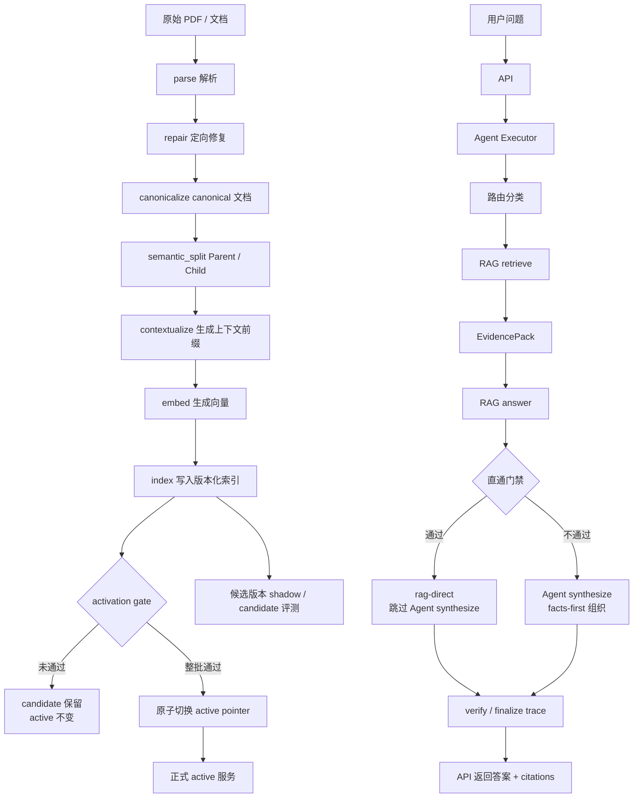
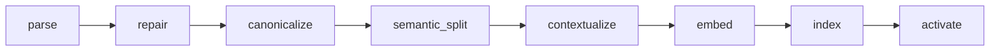
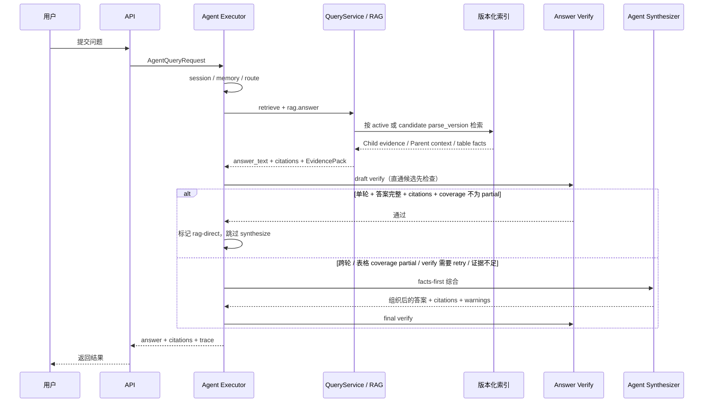
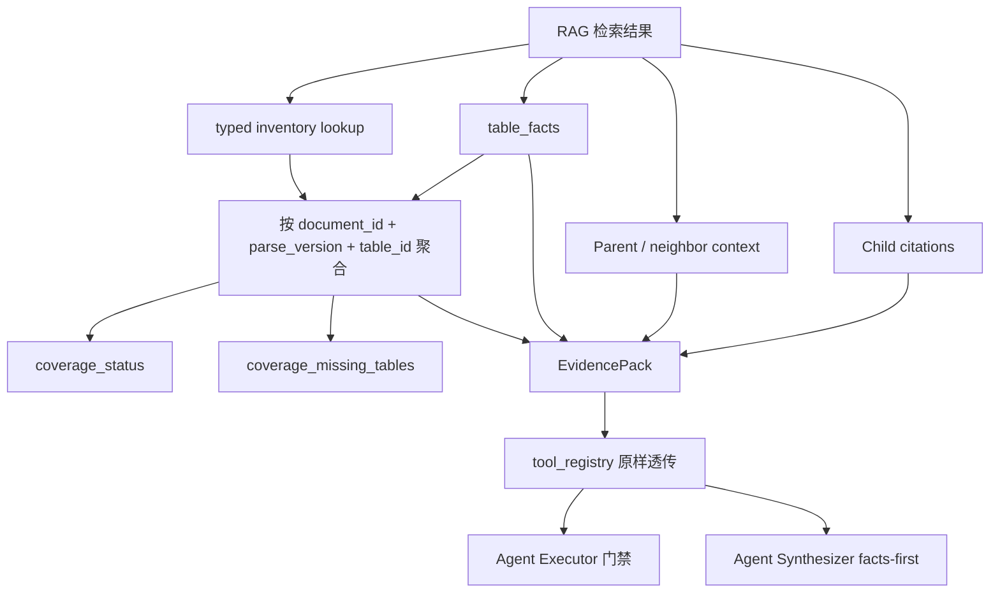
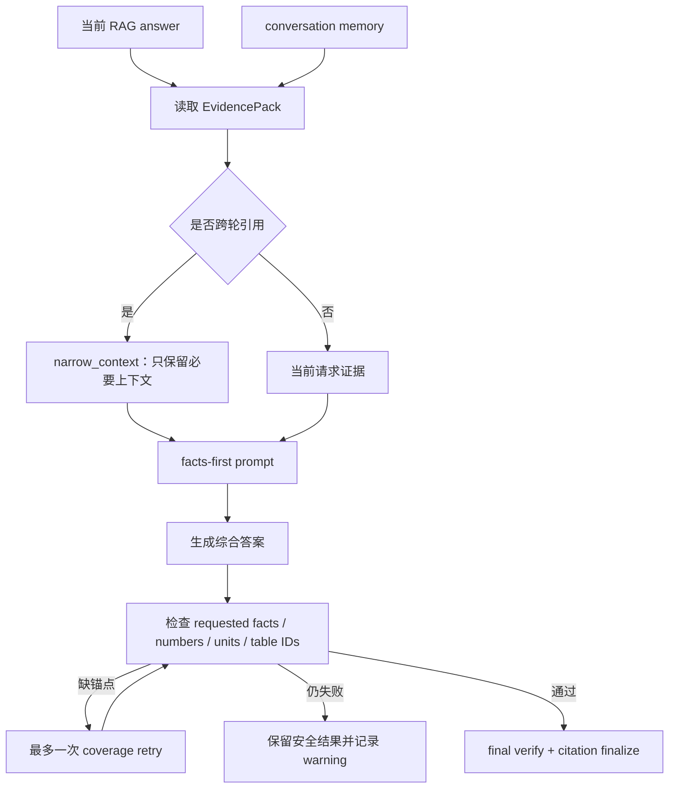
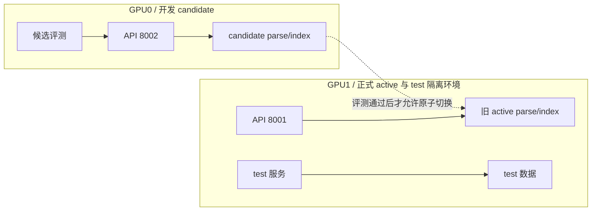

# 当前项目系统流程总览

更新时间：2026-08-07

本文根据当前工作树代码、Task 15/Task 9 文档和 GPU0 candidate 的实际运行状态整理。它用于区分三件容易混淆的事情：

1. 文档如何从原始 PDF 变成可检索数据。
2. 一次用户问题如何经过 RAG 和 Agent。
3. candidate、active、test 三套版本分别服务什么目的。

## 一、系统总图



核心结论：Agent 不是每次都要重新写答案。对普通单轮问题，RAG 已经生成了有引用的答案，并且通过完整性门禁时直接返回 `rag-direct`。只有跨轮引用、证据不足、验证失败、表格覆盖不完整等情况，才进入 Agent 综合或降级路径。

## 二、文档入库流程

### 2.1 八个阶段



### 2.2 每个阶段负责什么

| 阶段 | 作用 | 结果 |
|---|---|---|
| `parse` | 读取 PDF 并生成初始结构 | 页面、段落、表格、公式、图片等原始结构 |
| `repair` | 对解析质量问题做定向修复 | 修复后的结构化内容，不替代主解析器 |
| `canonicalize` | 形成稳定的 canonical document | 稳定的文档结构、表格结构和 source span |
| `semantic_split` | 按语义边界切分 Parent/Child | Parent 用于上下文展开，Child 用于检索 |
| `contextualize` | 为 Child 生成上下文前缀 | `embedding_text = contextual_prefix + child.text` |
| `embed` | 生成 Child 向量 | 带 `parse_version` 的向量 |
| `index` | 写入 pgvector / SQLite-vec / fallback 索引 | 版本隔离的可检索索引 |
| `activate` | 通过整批 gate 后原子切换 | 更新 active pointer；失败则保留旧 active |

### 2.3 表格和版本的关键约束

表格不是依赖 LLM 从截断文本中“猜出来”的。canonical 层会按以下三元组维护表格边界和事实：

```text
document_id + parse_version + table_id
```

每张表的 typed inventory 至少描述：

```text
table_id
child_ids / child_count
source_block_ids
row_count
```

表格事实 `TableFactEvidence` 还携带 `row_label`、`row_index`、`column`、`value`、`unit`、`term` 和 source chunk IDs。这样可以检查“Table 7 是否存在”和“1.18 / 1.12 是否真的来自该版本的证据”。

## 三、一次问题的执行流程



### 3.1 路由和处理方式

| 条件 | 默认处理 |
|---|---|
| `simple_rag`、`evidence_required`、`table_or_metric` 的普通单轮问题 | RAG 答案通过门禁后 `rag-direct` |
| `multi_source_compare` | 由 RAG 的多文档检索/整理能力先处理；若仍满足直通条件可直通 |
| 跨轮引用，例如“刚才那个”“前面提到的” | 使用 conversation context，进入 synthesize |
| `table_or_metric` 且 `coverage_status=partial` | 阻止直通，进入综合或降级 |
| 无答案、无 citations、`evidence-insufficient`、`contradicted` | 阻止直通，保留警告或进入综合/降级 |

## 四、三种实际回答模式

当前一次请求可能经过下面三种模式。要注意：`answer_model=rag-direct` 只代表 Agent 没有进行第二次综合，不代表 RAG 内部一定没有调用 LLM。

### 模式 A：确定性 RAG 组装 + Agent 直通

这是最快的路径，主要用于结构化表格、指标和参数查询。

触发条件：

- 检索结果中存在可用的 `table_facts`。
- 问题中的表号、行、列、指标或数值可以映射到结构化 facts。
- 代码能够完成去重、按 `table_id` 分组、按行列匹配和排序。
- 目标表 coverage 完整，不能是 `coverage_status=partial`。
- 答案非空、citations 非空，verify 没有判定矛盾，也没有要求 retry。
- 问题不是跨轮指代问题。

执行路径：

```text
问题
→ 检索 Child
→ 提取 table_facts
→ 按 document_id + parse_version + table_id 校验和分组
→ 代码去重、匹配、排序、拼接答案
→ verify
→ Agent 标记 rag-direct
→ 返回
```

这条路径通常不需要生成式 LLM 来写答案。它仍然需要检索、向量查询、表格事实提取和 verify，所以“确定性”不等于零耗时。

### 模式 B：RAG 调用一次 LLM + Agent 直通

这是普通叙述题和机制解释题的主要路径。

触发条件：

- 问题需要把多个 Child/Parent 证据组织成自然语言。
- 没有适用的确定性表格组装器，或者确定性组装无法覆盖完整表达。
- RAG 内部调用一次回答模型生成 `answer_text`。
- 生成结果有 citations，且通过 draft verify。
- 没有 `evidence-insufficient`、`contradicted`、retry 或 coverage partial。
- 问题不是跨轮引用。

执行路径：

```text
问题
→ 检索 Child / Parent
→ RAG 内部 LLM 根据证据生成答案
→ draft verify
→ Agent 判断结果满足直通条件
→ 跳过 Agent synthesize
→ answer_model=rag-direct
→ 返回
```

这条路径只调用一次生成式 LLM。Agent 仍然参与路由、门禁、verify 和 trace，但不会重新改写 RAG 答案。

### 模式 C：RAG + Agent 二次综合

这是需要会话上下文或 RAG 结果不满足直通门禁时的路径。

典型触发条件：

- 问题引用上一轮内容，例如“刚才那个”“它”“前面提到的模型”。
- `answer_text` 为空。
- citations 为空。
- RAG 返回 `evidence-insufficient`。
- verify 判定 `contradicted`。
- draft verify 建议 retry，且 retry 后仍需组织答案。
- `table_or_metric` 的 `coverage_status=partial`。
- 问题要求把历史会话、多个来源和当前证据重新组织成新答案。

执行路径：

```text
历史会话 + 当前问题
→ 扩展检索问题
→ RAG 检索并生成当前答案
→ 直通门禁不通过，或识别为跨轮问题
→ Agent synthesize
→ facts-first 检查数字、单位、表号和目标事实
→ 必要时最多一次 coverage retry
→ final verify
→ 返回综合结果或安全降级结果
```

Agent 综合器是组织器，不是事实来源。它只能使用 EvidencePack、结构化 facts、citations 和允许使用的会话上下文，不能凭空补充证据中不存在的数值。

### 三种模式对照

| 模式 | RAG 是否可能调用 LLM | Agent synthesize | 典型问题 | 典型速度 |
|---|---:|---:|---|---|
| A 确定性 RAG 组装 | 通常不调用 | 否 | 明确表号、行、列、指标、参数 | 最快，可能几秒 |
| B RAG LLM + 直通 | 调用一次 | 否 | 单轮概述、机制解释、证据归纳 | 通常几十秒 |
| C RAG + Agent 综合 | 通常先调用一次 | 是 | 跨轮引用、coverage partial、验证失败、复杂重组 | 最慢，可能触发 retry |

因此，评测报告中的 `synthesis_applied_rate=0%` 只能证明成功返回的题目没有进入模式 C；它不能单独证明所有题都走了模式 A。要区分模式 A 和模式 B，需要查看 RAG trace 中的 deterministic answer 标记、RAG provider/model 和各阶段耗时。

当前直通门禁在 `src/app/services/agent_executor.py` 中体现为：

```text
answer_text 非空
+ citations 非空
+ 非 evidence-insufficient
+ 非 contradicted
+ draft verify 不要求 retry
+ table_or_metric 不得 coverage_partial
=> synthesis_skipped=True, answer_model=rag-direct
```

## 五、EvidencePack 如何传递证据



`coverage_status` 的含义：

- `complete`：请求涉及的表和事实覆盖完整。
- `partial`：canonical inventory 表明请求目标存在，但当前证据预算没有完整覆盖；表格问题不得直通。
- `unknown`：旧调用方没有提供 inventory，或合并了不同来源的证据；对非表格路由保持中性，不强行阻塞。

附件证据合并后如果无法证明属于同一个版本，Executor 会将 coverage 降级为 `unknown`，避免把不同 `parse_version` 的 inventory 错当成完整覆盖。

## 六、Agent 综合流程

只有直通门禁不满足时，才会调用 `agent_synthesizer.py`：



综合器的职责是组织、压缩和处理跨轮上下文，不是凭空补充事实。表格事实优先来自结构化 `table_facts`；证据里没有的数字不能因为 LLM“推测合理”就写入答案。

## 七、candidate、active、test 的边界



当前边界：

| 环境 | 当前用途 | 当前状态 |
|---|---|---|
| GPU0 / API `8002` | candidate 开发、RAG/Agent 验收 | 当前 Agent 评测使用中 |
| GPU1 / API `8001` | 旧 active 正式版本 | 未修改、未切换 |
| test 环境 | 独立测试数据和服务 | 未修改、未重启 |

candidate 评测时必须显式使用 candidate 的 `parse_version_map` 或 candidate API。不能因为默认查询走 active，就把 active 的结果当成 candidate 的验收结果。

## 八、当前实际验证结果

### RAG candidate

最终 RAG candidate 报告为：

```text
30/30
answer_pass_rate = 1.0
citation_pass_rate = 1.0
strict_pass = true
route_identity = candidate
```

### Agent candidate

2026-08-07 的完整 Agent 评测报告：

```text
23/30
answer_pass_rate = 1.0
citation_pass_rate = 1.0
synthesis_applied_rate = 0%
strict_pass = false
```

失败原因是 7 题 `agent_status`，每题约 `120100 ms` 单题超时；不是 RAG 答案正确性或 citation 检查失败。已通过的 `opls5_table_metrics` 包含 Table 7 和相关数值预览，`ff99sb_ildn_table_parameters` 也已通过。

评测文件：

```text
/home/zhangyh/knowledge-agent-dev/runtime/task9-agent-direct-routing-full30-20260807.json
/home/zhangyh/knowledge-agent-dev/runtime/task9-agent-direct-routing-full30-20260807.log
```

因此当前不能激活 candidate。下一步应定位 Agent 超时发生在 `retrieve`、`rag.answer`、verify 还是 HTTP/队列等待，再针对性修复后重跑验收。

## 九、代码入口索引

| 组件 | 文件 |
|---|---|
| Agent 主执行器、直通门禁、trace | `src/app/services/agent_executor.py` |
| Agent facts-first 综合、coverage retry | `src/app/services/agent_synthesizer.py` |
| RAG 检索、表格事实、coverage 构造 | `src/app/services/search.py` |
| EvidencePack / TableCoverage schema | `src/app/schemas/agent.py` |
| 工具层 EvidencePack 透传 | `src/app/services/tool_registry.py` |
| canonical manifest 与 typed inventory | `src/app/services/canonical_artifacts.py` |
| 版本化重建、activation gate、原子切换 | `scripts/rebuild_canonical_index.py` |
| Agent 全量评测 | `scripts/evaluate_agent_full.py` |
| 阶段进展记录 | `docs/work.md` |

## 十、最重要的判断

```text
RAG 30/30 通过
        ↓
Agent 普通单轮应优先 rag-direct
        ↓
只有需要跨轮、覆盖不完整或验证失败时才综合
        ↓
当前 Agent 仍有 7 题超时
        ↓
candidate 尚未达到可激活条件
```

active 仍是旧版本；candidate 仍是候选版本；本轮没有删除旧 active，也没有执行原子切换。
