# 科学文献 RAG 本地知识库 —— 项目运行全流程手册

> 本文档事无巨细地描述系统从"用户上传一篇论文"到"拿到带引用的证据型答案"的完整运行链路：文档摄取流水线、检索与召回、Agent 编排与 LLM 调用、API 与前端交互、部署运维与测评体系。所有细节均对照 `src/app/` 代码梳理；术语遵循 `CONTEXT.md`（会话/轮次/draft 直通/综合路径/上下文化/轮次压缩）。

---

## 0. 系统总览

**Knowledge Agent** 是一个面向科研团队的论文知识库与证据型问答系统，三层架构：

1. **文档规范化层（Canonical）**：任意 PDF/docx/html/md/txt → 8 阶段版本化流水线 → 结构化证据（双层分块 + 类型化表格/图/公式事实），每阶段产物 SHA-256 指纹校验，支持批量原子切换。
2. **混合检索层（RAG）**：词法路由（论文级 + 查询意图级）→ 向量检索（pgvector/sqlite-vec 双后端）+ 全库补充路 → 统一评分融合 → 确定性表格直通 / LLM 草稿生成。
3. **有界 Agent 编排层**：路由 → 规划 → 检索 → 作答 → 综合 → 验证 → 重试（最多 1 次）的确定性循环；三种作答路径（确定性表格 / 单次 RAG 草稿直通 / 事实优先综合）。

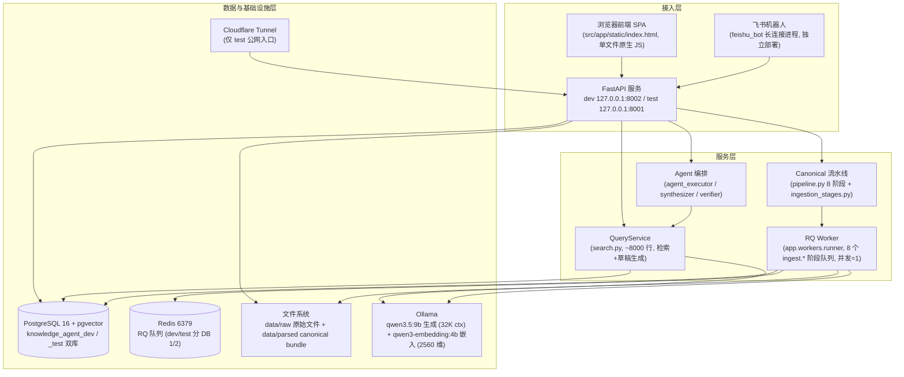

**核心链路一句话**：浏览器上传 PDF → API 落盘并注册文档 → RQ 队列串行执行 8 阶段流水线（MinerU/视觉解析 → 质量门 → 双层语义分块 → 嵌入 → 索引 → 原子激活）→ 用户在聊天框提问 → Agent 路由 → 检索（向量+词法+补充路）→ 确定性表格直通或 LLM 草稿 → 验证 → （必要时综合）→ 带 `[N]` 引用标记的答案 → 前端渲染可点击溯源。

---

## 1. 部署拓扑与进程模型

### 1.1 双环境隔离

同一台双 GPU 服务器运行两套完全隔离的环境（`deploy/internal-pilot.md`、README.md）：

| 环境 | API | Ollama | GPU | 访问方式 | 数据库 |
|---|---|---:|---:|---|---|
| dev（开发） | `127.0.0.1:8002` | `127.0.0.1:11435` | GPU 0 | SSH 转发（**严禁 Tunnel 暴露**） | `knowledge_agent_dev` |
| test（测试） | `127.0.0.1:8001` | `127.0.0.1:11436` | GPU 1 | Cloudflare Tunnel（受保护公网入口） | `knowledge_agent_test` |

- 目录：`~/knowledge-agent-dev` / `~/knowledge-agent-test`，模型缓存共享 `~/knowledge-agent-models`。
- 配置：`.env.development.example` / `.env.test.example` → 复制为各自 `runtime/app.env`（权限 600，**禁止提交实际 secret**）。
- 两套 Ollama 均：`qwen3.5:9b`（回答生成）+ `qwen3-embedding:4b`（2560 维嵌入）、Flash Attention、q8_0 KV Cache、并发 1、闲置 5 分钟释放 GPU（`OLLAMA_KEEP_ALIVE=5m` 仅 Ollama 侧；应用侧嵌入请求硬编码 `keep_alive="0"` 即用即卸）。

### 1.2 systemd 进程拓扑

全部为 systemd **user** services（`deploy/systemd/`，安装到 `~/.config/systemd/user/`），每个环境一套：

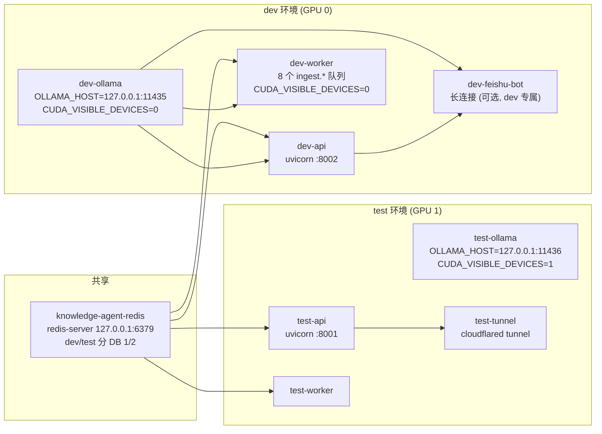

**依赖与启动顺序**：
- `api`/`worker` 均 `Requires=redis`、`After=ollama`；启动顺序实质为 **Redis → (DB) → API + Worker**，Ollama 并行。
- api 启动即 `init_db()`（建表 + SQLite 轻量迁移），worker 启动同样 `init_db()`——两者都依赖数据库可连。
- 飞书机器人 `After=dev-api`（文件入库/问答都经 `FEISHU_BOT_API_BASE_URL=http://127.0.0.1:8002` 走本地 API，不直接碰数据库）。
- Tunnel `After=test-api`，ingress 仅把 `research.example.com` 转发到 `http://127.0.0.1:8001`，其余 404；credentials 在 test runtime 目录。
- 崩溃自愈：全部 `Restart=on-failure`；机器人启动失败退出码 1 交 systemd 重试。

### 1.3 启动脚本（本地开发机，`scripts/`）

| 脚本 | 行为 |
|---|---|
| `start_api.sh` | 检查 `.env` → source → `nohup uvicorn app.main:app`，PID 写 `run/api.pid`、日志 `logs/api.log`；已运行则跳过 |
| `start_worker.sh` | 同上启动 `python -m app.workers.runner` |
| `start_ollama.sh` | 先 curl `/api/tags` 探测可达则跳过；`OLLAMA_HOST`（默认 11435）+ `OLLAMA_KEEP_ALIVE=5m` |
| `start_redis.sh` | 生成 `run/redis.conf`（bind/port/appendonly no/protected-mode yes + 快照策略）→ nohup redis-server；redis-cli ping 幂等 |

Dockerfile（备选封装）：`python:3.11-slim` + `pip install .` + `uvicorn :8000`；生产实际以 systemd 直跑 venv 为主。

### 1.4 应用生命周期（FastAPI lifespan）

1. `configure_logging()` 初始化日志。
2. `init_db()`：建表 + SQLite 轻量迁移（补列/回填 parse_version/重建 document_chunks 自引用外键/建索引）。
3. 确保默认项目存在。
4. 启动清理：删除过期会话（TTL 30 天）与超保留期 trace（30 天）——失败仅记日志不阻断启动。
5. `MAINTENANCE_MODE_ENABLED=true` 时：拦截 `/api` 下所有非 GET/HEAD/OPTIONS 写请求 → 503 + `Retry-After: 60`；放行 `/api/auth` 与静态资源（维护期间可登录，用于迁移演练）。

端口汇总：dev API 8002、test API 8001、Ollama 11435/11436、Redis 6379（dev/test 分 DB 号 1/2）、Docker 容器内 8000、飞书机器人无端口（出站长连接）。

---

## 2. 文档摄取流水线（上传 → 可检索）

用户上传文件到 `ready` 要经过 8 阶段 Canonical 流水线。编排在 `services/pipeline.py`，各阶段处理器在 `services/ingestion_stages.py`。

### 2.1 全流程总览

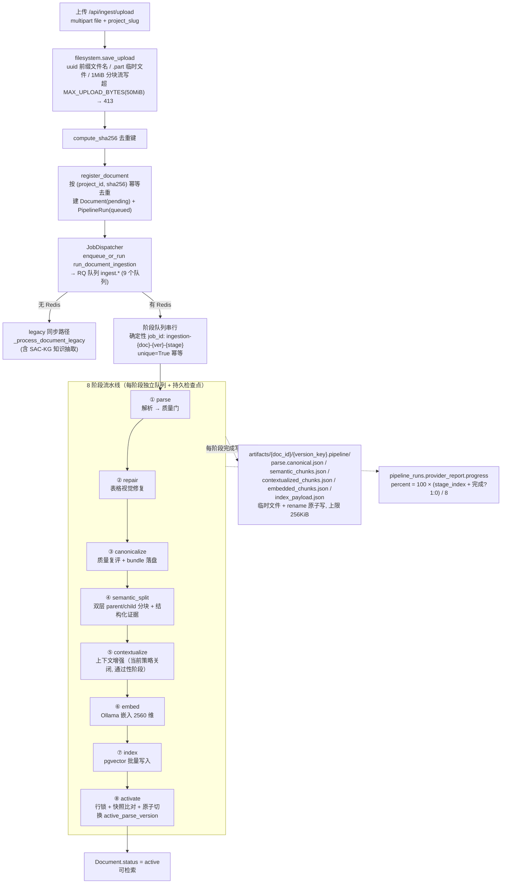

### 2.2 上传与注册

- **文件类型**：`.pdf`（深度链路）、`.docx`、`.html/.htm`、`.md/markdown`、`.txt`；未知后缀一律按 Text 处理。
- **上传限流**：`MAX_UPLOAD_BYTES=50MiB`，超限 413（`UploadTooLargeError`）；无文件名 400；slug 非法 400。
- **安全**：文件名清洗为 `uuid4hex-前缀`，杜绝路径穿越；写库前剥离 NUL 字节（PostgreSQL text 列拒绝 `\x00`）。
- **幂等**：`(project_id, sha256)` 去重；项目按 slug 幂等自动创建。
- **注册**：建 `Document(status=pending)` + `PipelineRun(queued)` → `process_document`：有 Redis 则创建/复用 parse version（版本键见 2.8）→ `_first_actionable_stage` 跳过已完成阶段 → 入队第一个未完成阶段（进度 5%）；无 Redis 走 legacy 同步路径。

### 2.3 ① parse —— PDF 多层解析回退链

入口 `_run_canonical_parse_stage` → `parse_canonical_document`（`canonical_adapters.py` 按后缀分发：PDF→PDFCanonicalAdapter，docx/html/md/txt→对应适配器，未知→Text）。产出 canonical 文档（blocks/tables/figures/formulas/assets/outline/质量报告，模型见 `canonical_models.py`）。

**PDF 回退链（核心）**：

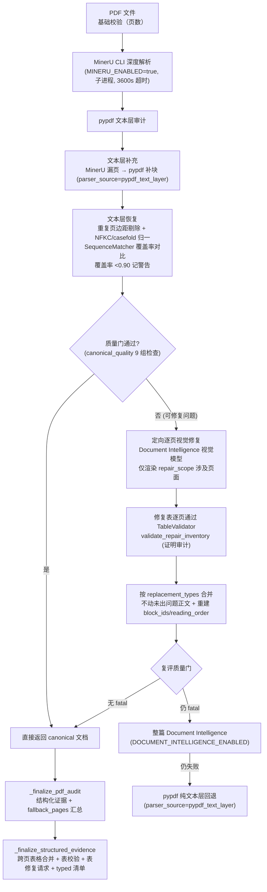

关键细节：
- **MinerU 配置**：`MINERU_ENABLED=true`、`MINERU_BACKEND=pipeline`、`MINERU_TIMEOUT=3600`；可用性依赖 `.venv` 下 `mineru` 可执行文件。
- **质量门**（`canonical_quality.py`）：9 组检查 = 页面缺失 / 内容为空 / 阅读顺序不连续 / 资产非法 / 摘要缺失 / 表格非法 / 表格清单冲突 / 图注缺失 / 公式分析缺失。严重度惩罚：info 0.0、warning 0.05、error 0.15、fatal 0.35；`score = max(0, 1 − Σ)`。终态：fatal→rejected、可修复→validation_failed、仅警告→accepted_with_warnings、否则 accepted。repair_scope 记入 fallback_pages 驱动定向修复。
- **表格修复证明审计**（fail-closed）：视觉修复表须附 `TableRepairProof`（match_basis：source_region_id / normalized_bbox（IoU≥0.8、中心/边界差≤0.02）/ source_block_id / unique_table_on_page + validated_mapping）；`validate_repair_inventory` 逐页原子核对计数、ID、内容指纹唯一性（唯一二分匹配 + 交替环检测），失败拒绝激活。
- 表格状态：`parsed / accepted_mineru / repaired_by_vision / cross_page_merged / validation_failed`。

### 2.4 ② repair —— 表格修复

仅存在表格问题且可修复时触发：`TableRepairRequest`（table_id、原因、定位、源指纹、指令）→ 视觉模型产出修复表 → `TableRepairProof` 校验 → 合并。单表修复强制走 `repair_inventory_missing` 路径。

### 2.5 ③ canonicalize —— 质量门 + 原子落盘

- **质量复评**：同 2.3 质量门（accept 才放行下一步）。
- **canonical bundle 落盘**（`canonical_artifacts.py`）：写 staging 目录 `{version}.staging-{uuid4hex}`（canonical.md（YAML front matter）+ manifest.json（input_fingerprint、canonical_markdown_sha256）+ blocks.jsonl + tables/figures/formulas.json + assets/），**全部临时文件 + fsync 后 `os.rename` 原子 promote** 为正式 `{version}` 目录。幂等：input_fingerprint 相同复用已有 staging。加载时 `_validate_bundle` 全量校验（顶层文件清单精确匹配、无符号链接、sha256 复算、record 契约、typed_inventory 校验）。

### 2.6 ④ semantic_split —— 双层 parent/child 语义分块

`services/semantic_chunking.py`，核心算法：

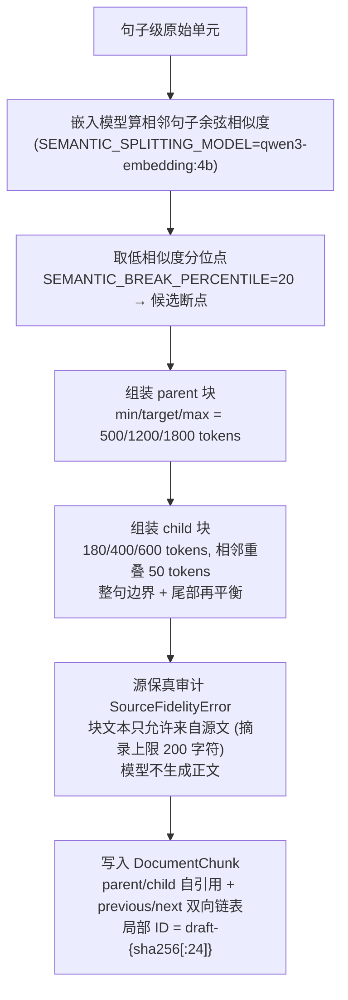

**结构化证据（表格/图/公式）**——`StructuredEvidenceBuilder` 独立处理：
- **表格**：父块 = 整表文本；子块 = 语义行组（元数据配置或首列启发式）→ 超 token 上限再分（超长行用列组/单元格分片 lossless 窗口）→ 缺脚注补块。
- **跨页表格合并**：`continuation_of` 图、单子块、无环、相邻页、表头必须匹配、重复表头行跳过；行元数据带 original_table_id/page_index/row_index；状态 `cross_page_merged`。
- **图/公式**：父块含 nearby source text（阅读顺序距离 ≤2 且同页的 narrative/appendix 块，最多 2 个）；模型只产 embedding_text，不生成正文。
- **稳定 ID** = `prefix-sha256(部件以 \x1f 连接)[:24]`。
- **typed inventory**（tables/figures/formulas/row_indices/orphans）写入 manifest，激活门处 fail-closed 比对（行覆盖必须等于 range(row_count)）。
- **边界常量**：表格行 10,000 / 列 1,000 / 网格 1,000,000；单资产 64MB、整文档资产 256MB；canonical adapter 资产缓存 4GB（溢出拒绝）；HTML 嵌套深度 256。

### 2.7 ⑤ contextualize —— 上下文增强（当前策略关闭）

`contextualization.py` 已完整实现（批处理 BATCH_SIZE=12、`_recover_batch` 容量错误二分降级、2s/8s 重试、11 项前缀校验含关系谓词列表），但 `contextualization_policy.py` 中 `CONTEXTUALIZED_BLOCK_TYPES = frozenset()`（空）——**所有块类型当前都走"纯原文嵌入"**，contextual_prefix 不生成。阶段仍执行、产物文件照写（通过性阶段）。

### 2.8 ⑥ embed + ⑦ index + ⑧ activate

- **embed**：对每块取 embedding_text（contextual 关闭时即原文）→ Ollama `/api/embed`（`keep_alive="0"` 即用即卸 + `num_ctx=16384`）→ 写入 `DocumentChunk.embedding`（JSON 兼容列）+ `embedded_chunks.json` 检查点。token 计数：`injected_counter / transformers / utf8_bytes_fallback` 三模式（进程级缓存 + 按 key 锁）。
- **index**：pgvector 路径写 `ChunkVector`（chunk_id/document_id/embedding/parse_version）`replace_document_chunks` 批量替换；回填 typed_inventory 的 child 信息。嵌入失败 → `embedding_failed`（可重试，重试从失败阶段重新入队）。
- **activate（原子切换，并发安全三件套）**：
  1. `SELECT ... FOR UPDATE` 行锁（先锁 Document 行、再锁 parse version 行，固定锁序防死锁）；
  2. `set_committed_value` 快照（读已提交值作基线，变了就回滚重来）；
  3. 切换 `documents.active_parse_version` → 新 version_key，写 `activated_at`，状态 → `active`。
  - **激活门**：record 契约、无 validation_failed 表格、quality accepted/accepted_with_warnings、table_activation_allowed=True、typed_inventory 校验通过。
  - 批处理 `batch_activate` 同理。

### 2.9 版本化与 SHA-256 指纹体系

- **版本键**：`"{canonical_pipeline_version}-{source_sha256[:12]}-{config_hash[:12]}"`（如 `canonical-v4-xxxx-xxxx`）——确定性：同一文档同配置重跑不重复计算。
- **指纹出现位置**：源文件（上传时 compute_sha256，去重键）；canonical.md 的 `canonical_markdown_sha256`；bundle `input_fingerprint`；资产文件 sha256；表格内容指纹与身份指纹（`canonical_table_identity.py`）；解析版本配置快照哈希（算法修订号 + tokenizer 身份 + 嵌入模型/维度 + 切分参数，canonical sort-keys JSON 再哈希，`ingestion_identity.py`）。
- **算法修订常量**（`pipeline.py` ALGORITHM_REVISIONS）：parser `canonical-parser-v6`、pdf_recovery `pdf-recovery-v2`、structured_splitting `structured-splitting-v3`、source_fidelity `source-fidelity-v1`、schema `source-fidelity-schema-v1`。
- **tokenizer 指纹**：`SEMANTIC_TOKENIZER_NAME/REVISION` + 本地快照 `.knowledge-agent-tokenizer-snapshot.json`（内容哈希带 4 字节大端长度前缀）。
- **重放**：阶段检查点重放校验指纹冲突（`StageCheckpointTooLarge` 上限 256KiB）。

### 2.10 RQ 队列机制与并发控制

- **队列拓扑**：默认队列 `"ingest"` + 每阶段专属队列 `ingest.parse / ingest.repair / ingest.canonicalize / ingest.semantic_split / ingest.contextualize / ingest.embed / ingest.index / ingest.activate / ingest`（systemd 的 `INGESTION_WORKER_QUEUES`）。
- **确定性 job_id**：`"ingestion-{doc}-{ver}-{stage}"` + `unique=True` → 天然幂等。`DuplicateJobError` 策略：queued/started/deferred/scheduled 复用原 job；failed 重排；finished/stopped/canceled 删除重建；最多 3 次尝试。
- **worker 约束**：`INGESTION_WORKER_CONCURRENCY=1`（**必须串行**，与 activate 行锁配合）；`REDIS_URL` 指向 Redis；job timeout 9000s（`QUEUE_JOB_TIMEOUT`）。
- **claim/lease 并发控制**：阶段检查点 status="running" + claim_owner + lease_expires_at（TTL = queue_job_timeout + 300s）；他人撞到 `StageAlreadyClaimed`，仅租约过期后允许接管（防 worker 崩溃死锁）。
- **Redis 未配置时**：整个模块退化为同步直调（本地开发/测试模式）。

### 2.11 文档状态机

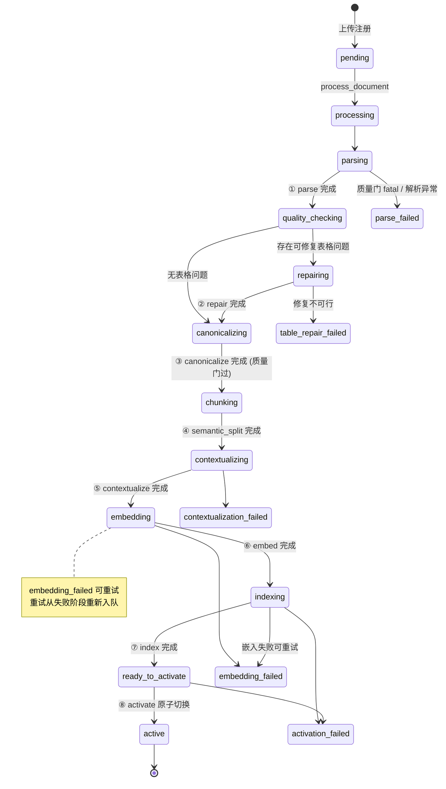

- **阶段完成映射**：parse→quality_checking、repair→canonicalizing、canonicalize→chunking、semantic_split→contextualizing、contextualize→embedding、embed→indexing、index→ready_to_activate、activate→active。
- **失败终态**：`failed`（通用）、`parse_failed`、`table_repair_failed`、`contextualization_failed`、`embedding_failed`、`activation_failed`；`FAILED_STAGE_RETRIES` 按失败类型映射重试次数；`ALLOWED_TRANSITIONS` 限定合法跳转。
- **版本状态机**（`parse_versions.py`）：queued → parsing → … → ready_to_activate → active；旧版（legacy）解析版本迁移时标 `quarantined`。

### 2.12 会话临时附件（不走 Document 注册）

`session_attachments.py`：上传到 `raw_dir/{slug}/__sessions__/{session_id}/`（防穿越：slug 白名单 + session_id 禁分隔符 + resolve 后前缀校验）；PDF 走 pypdf 文本层轻量解析（省去分钟级视觉链路），其余走 parse_document → SessionAttachment + SessionAttachmentChunk（token_estimate ≈ len//4）；检索侧 `retrieve_session_attachment_evidence` 按查询词 token 重叠计数确定性排序，零重叠回退取实质块（>20 字符），严格限定 `(project_slug, session_id)` 作用域。

---

## 3. 检索与召回层（QueryService）

核心是 `services/search.py` 的 `QueryService`（约 8000 行）——检索、评分融合、上下文打包、确定性表格作答、LLM 草稿生成全在这一层。配套 `vector_store.py`（双后端）、`rag_adapter.py`（Agent 薄封装）、`paper_profile.py`（论文画像/路由数据源）。

> **重要事实**：本分支**没有 BM25 / RRF**——曾设计并实现（R2 spec 2026-08-18），2026-08-19 由 commit 36c1444 双口径证伪后删除（SciFact 归因 bm25off nDCG +0.0009≈0；内部 30 题 A/B 30/30 零依赖）。生产现役"补充路"是 **R1 全库向量补充路**。

### 3.1 检索全景

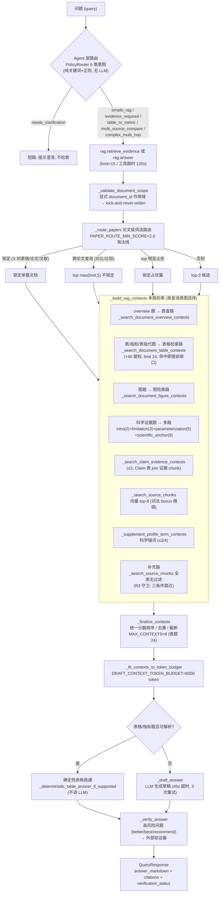

### 3.2 双层路由

**① Agent 层：PolicyRouter**（`agent_policy.py`）——按优先级"首个命中即返回"：

| 优先级 | 路由 | 判定逻辑（纯关键词/正则，无 LLM） |
|---|---|---|
| 1 | `needs_clarification` | 查询为空/纯空白 |
| 2 | `complex_multi_hop` | 链式指示词（"first find…then calculate"、先找到/再计算/分步/多步）或编号子问题正则 `(?:^|\n)\s*[1-9]\d*\.` |
| 3 | `multi_source_compare` | compare/difference/versus/vs、对比/比较/区别/不同/相比 |
| 4 | `table_or_metric` | table/metric/value、表/指标/数值；"parameter/参数"须与语境词（数值/是多少/列出/单位等）共现；`\bkcal\b`、Å、angstrom、`\d+%` |
| 5 | `evidence_required` | citation/cite/reference/source/evidence、引用/证据/来源/原文 |
| 6 | `simple_rag` | 兜底默认 |

决策附 `requires_citations`、`max_retries`、`confidence=1.0`、`reason`，驱动执行器的工具白名单与作答策略。**max_retries 配额**：needs_clarification/complex_multi_hop/simple_rag = 0；multi_source_compare/table_or_metric/evidence_required = 1。

**② RAG 层：`_route_papers`**（search.py:938）——论文级打分路由：
- **打分公式**：`query_terms∩profile_terms`（+1）+ `∩raw_terms`（+1）+ `∩title_terms`（×3）+ `∩alias_terms`（×5）+ `∩key_terms`（×2）+ 科学 selector 命中（×4）+ "本文引入/we introduce" 句型内引入数（×12）+ primary subject selector（×18）+ 精确别名（+18）。`PAPER_ROUTE_MIN_SCORE=2.0` 淘汰线。
- **锁定分支顺序**：① 问题含"X 的表格/论文/文献"、"X's table/paper"、"X 相比"→ 锁定；② 显式 document_id 作用域 → 强制锁定；③ 比较句主体 selector 在问题前 24 字符内 → 锁定；④ 精确别名（独立词边界）→ 单个锁定、多个取 primary 或最多 5 个；⑤ 跨论文查询（compare/versus/比较/对比）→ top max(limit,5) 不锁定；⑥ 单篇 introduced_subject 或 top 明显占优（score≥10 且领先 ≥8 分或 1.75 倍）→ 锁定；⑦ 否则 top-3 候选。

**③ 查询意图分类器**（`_is_*` 系列）——决定走哪条检索路径：
- `_is_table_query`：table N / 表 / tabular → 表格检索路（limit 24）；`_is_metric_query`：f1/auc/precision/rmse 等指标词（pKa 特例须共现）→ 表格路；`_is_figure_query`：figure N / 图 → 图检索路；`_is_table_reference_query`：中文序数指代（"第二张表/这张表"，`table_reference.py`）→ 表格放宽匹配；`_is_document_overview_query`："这篇论文讲了什么" → overview 直查；`_is_scientific_evidence_query`：命中 `_SCIENTIFIC_CONTEXT_ANCHORS`（~60 个科学实体锚点：Drude、LFMM、CHARMM36m、Lennard-Jones…）→ 科学证据多路；`_is_mechanism_question`：因果问词——**已无生产调用点**（保留作未来路由契约）。

### 3.3 向量检索

- **模型**：`qwen3-embedding:4b`，维度 2560，走 Ollama `/api/embed`；**每个 query 只 embed 一次**——`question_vector` 在 `_build_rag_contexts` 先算好，文档内检索与全库补充路复用（R1 性能优化，单次约秒级）。
- **双后端**（`vector_store.py`）：`SQLiteVecStore`（默认 sqlite-vec；元数据表 + 按维度分表的 vec0 虚拟表）；`PGVectorStore`（pgvector 单表，余弦距离 `embedding <=> CAST(:embedding AS vector)`，L2 归一化后点积等价余弦）。
- **top-k 与过滤**：`_search_source_chunks` 请求 `limit = max(limit*20, 50)`（limit=8 → 160 候选）；过滤 = `document_ids` 作用域（可选）+ **parse_version 隔离**（常规要求索引版本 == active 版本，active 空则 legacy；`parse_version_map` 提供"影子版本"覆盖——验收运行时评估 staged 版本不污染 active）。
- **候选扩张**（sqlite 后端）：初始 `max(limit, 50)`，命中不足且未到全表按 ≥2 倍指数扩张重试。
- **运行时**：embed 请求硬编码 `keep_alive="0"`（即用即卸，与生成模型共卡不争显存）+ `options.num_ctx=16384`；与生成模型驻留 5m 曾挤掉生成模型导致 schema 输出崩坏——历史事故。
- **降级链**：`available()` 惰性探测（开关+后端+方言+扩展安装，结果缓存）→ 检索异常返回空 → 调用方回退 **JSON embedding**（`chunk.embedding` 列 Python 余弦，同样 10×cosine 尺度）→ embed 调用失败 → 纯词法打分。

### 3.4 全库补充路（现役，R3 归因修正版）

形态：`_build_rag_contexts` 末尾总是并入一次 `_search_source_chunks(question, project_id, [], limit=MAX_CONTEXTS, question_vector=复用, table_promotion=False)`——全库（无 document_ids 过滤）向量 top-8，**不做表格提权**（防无关文档表格挤占）。

**跳过守卫（只有三种情况）**：① 显式作用域（document_ids 非 None，lock-and-never-widen 语义）；② overview 查询；③ **路由锁定 + 结构化查询**（表/指标/表指代/图——用户明确要某论文的表/图，混入其他文档表格即表错论文）。

> **归因实验背景**（`.task18-corpus/attribution_eval.py`，2026-08-19）：原守卫在"路由锁定"时也跳过补充路，被证伪为纯伤害——noroute−routed = **+0.1182**，68/300 帮倒忙、9 帮上忙，8 条 nDCG 1.0→0.0 全是 routed 单 PMID（词法启发式锁错论文时补充路被整体跳过，正确文档永远不可见）。修复后**路由锁定（prose 声明题）不再跳过补充路**，靠锁定文档的 route bonus 在分数融合中占优，真相关仍排前（测试 `test_route_locked_scope_runs_full_library_supplement`、`test_route_locked_wrong_doc_supplement_rescues_correct_doc` 固化）。
>
> 补充路的历史价值：SciFact 评测 R1 前 nDCG 0.4422（56.7% 未召回，纯词法路由二值匹配：命中即第 1、miss 即不可见）→ R1 补充路上线 0.7654 → R3 守卫修复后 **0.8503（0 未召回）**；BM25 移除后仍 0.8503 量级（+0.0009≈0）。生产目标 nDCG ≥0.86 未最终达成。

**第二层兜底**：answer/retrieve_evidence 内 contexts 为空且无锁定且非 overview 时，再试 `_search_source_chunks(limit=5)`。

### 3.5 评分融合与排序（`_finalize_contexts`）

生产**不是 RRF**（rank 融合只在 SciFact 实验里出现：hybrid BM25 top-10 ∪ 向量 top-10 RRF k=60 → 0.8691，未上线）；生产是 **chunk 级 score 融合**：

| 分数来源 | 尺度 |
|---|---|
| 向量相似度 | `10 × (1 − distance)`，0~10（余弦 → 10 倍化） |
| 词法 bonus | `min(overlap×0.05 + route_overlap×0.08, 0.4)` + `min(rare_route_overlap×0.6, 1.2)`（术语在 ≤3 个 chunk 出现才叫稀有）——总量 ≤1.6，**不允许字面重合反超 0.16 余弦以上的语义差距**（Forward KL 事故驱动收敛） |
| 表格 | `TABLE_CONTEXT_SCORE_BOOST = +40` |
| profile 术语 | 3.0 + 1.5n；命中科学锚词表则 28.0 + 3.0n |
| claim 证据 | 12.0 + 1.5×overlap + 3.0×锚点数 + 置信度 |
| overview | 20.0 + 页码/摘要/引言位置加分 |

- **排序**：非表查询 = 纯 `context.score` 降序；表查询 = 四元组 `(structure_priority, relevance, evidence_priority, score)`——structure_priority（图锚 4.0 / 公式 4.0 / 表锚 3.0 / 表 2.0 / 其他 0）、relevance（问题显式点名表格锚 +100、generic 表术语 +权重×3、行选择器 +6）。
- **去重**：非表 chunk 用 `page_slug|document_id : page_label : 前180字符归一化excerpt` 前缀 key；**canonical 表行用 chunk_id/table_id 身份 key**（表行共享长 preamble，前缀 key 会塌缩丢数值行）；每 page 限流 `min(5, context_limit)`（profile-term 不限）。
- **截断**：上限 `MAX_CONTEXTS=8`，表/指标题 `CANONICAL_TABLE_CONTEXT_LIMIT=24`；超限时 `_required_evidence_contexts` 保底（table/figure/formula/profile-term 各保 1）；非表题 profile-term 按 17 个高价值科学锚去重优先。
- **support_hint 门**（`_determine_support_hint`）：score ≥15 → direct（**只有表格路够得到**，文字证据最高 ~11.6——有意设计：防照抄证据原文）；≥5 → contextual；问题词元出现在证据文本 → contextual；否则 weak。
- **天花板现状**：BM25 时代唯一的显式 cap（6.0）已随 BM25 删除；现役均为局部 cap（词法 0.4 / rare 1.2 / 纯词法总分 1.2 / 同页引用 2 条 / repair fact 清单 60）。

### 3.6 上下文打包（`_build_rag_contexts` → `_fit_contexts_to_token_budget`）

- **命中后展开**：一次 SQL 拉取 parent/previous/next chunk（neighbor 仅 overview/cross-paper 题）；正文证据取 **parent 全文**，若命中 child 文本不在 parent 内追加 `Matched child:` 段；`Neighbor context:` 段受 `NEIGHBOR_EXPANSION_TOKEN_BUDGET=900` token 限制；**表格 child 不展开 parent**（行级无失真实体，邻居是重复证据）。
- **表格 sibling 展开**：canonical 表命中一行 → 按 `(document_id, parse_version, table_id)` 展开同表全部行（命中行保持第一，sibling 分 = score − 0.000001×行距）；问题显式命名的其他表整表纳入（max_score − 0.5）；`_attach_complete_table_evidence` 组装完整 TableContext + TableFact（每行一个 citation）。
- **token 预算**：`DRAFT_CONTEXT_TOKEN_BUDGET=6000` 硬预算，用检索侧 tokenizer（`StructuredEvidenceBuilder.estimate_tokens`）精确计数（**无字符窗口截断**——历史事故：字符窗口曾静默丢父块/数值行）；表题先排表行（锚点命中数、词元重叠、score）；parent 完整展开上限 `MAX_COMPLETE_PARENT_CONTEXTS=6`；超预算依次降级：去重叠前缀（`_remove_prompt_overlap`）→ 截 excerpt → 表格行丢弃 → `_rescue_term_window`（以问题相关科学短语为锚保留 400 字符最小窗口）。
- **prompt 文本**：`[i] {完整证据}` 列表 → LLM prompt = Question + "Answer using only the retrieved source evidence…显式回显问题中每个实体/术语/指标" + 约束段 + 证据列表。
- **引用**：规范化标记、支持性校验、表题仅保留表格引用、同页最多 2 条；证据不足（模型输出 "insufficient evidence" 头）→ 清空引用。
- **Agent 证据包**（`retrieve_evidence`，默认 limit=15）：EvidenceItem 带 `source_stage`（document_table/figure/profile_term/claim/source_chunk）与 `support_hint`；`table_facts`（fact_id = table+row+column+value 的 SHA256 前 16 位）；`inventory/coverage_status/coverage_missing_tables`（table coverage 门禁：complete/partial/unknown，partial+缺失表 → `_fill_requested_table_contexts` 定向补表，补完标记 complete）。

### 3.7 确定性表格直通（不经过 LLM 的作答）

`search.py _deterministic_table_answer_if_supported`：`_is_table_query`/`_is_metric_query` 且解析出 table_indexes → 产出"已在表格证据中找到相关指标：…"式模板答案，值来自 `extract_table_facts` 结构化 facts（确定性，非 LLM）；有 ablation/metrics/通用表格模板 + "证据中没有可解析指标"明确否定句。表格指代查询另注入 table_facts（完整行值）。

### 3.8 检索侧失败降级链（总表）

| 故障 | 降级 |
|---|---|
| 向量库不可用 | JSON embedding Python 余弦（同 10×cosine 尺度） |
| embed 调用失败 | 纯词法打分（总分 cap 1.2） |
| LLM 草稿生成失败 | 3 次重试（网络错/ValidationError/空内容可重试）→ 接受自由文本（≥30 字符、非纯数组垃圾、提取 `[n]` 引用）→ 原始证据降级（`## 回答\n[系统提示：LLM 生成暂时失败，以下为原始检索证据，仅供参考]`） |
| 无上下文 | 固定提示语 |
| 项目不存在 | 空包/空响应降级（不崩溃） |
| 答案未回显关键科学术语 | `_should_append_supported_evidence_terms` 检测 → `_append_missing_supported_question_terms` 二轮补写（带 "Preserve … exactly" 指令） |

### 3.9 性能关键点（事故与修复）

- **正则预编译**（2026-08-18 事故）：`_route_papers` 全库逐文档循环中按 alias 动态拼接编译正则，打穿 Python re 内部 512 缓存后每 claim 重复编译 5 千次（cProfile：re._compile 56,060 次/13.4s，单 claim 检索 28.3s）→ 三个 `@lru_cache(maxsize=8192)` 预编译缓存（`_subject_lock_patterns`、`_selector_boundary_pattern`、`_alias_boundary_pattern`）跨 claim 全命中修复。
- **question_vector 复用**：一次嵌入，文档内检索 + 全库补充共用，0 额外开销。
- **version 隔离贯穿全链**：向量路（shadow map 进 SQL）、SQL/词法路、finalize 重水合（按 active/shadow 版本重查 chunk 重建 citation）三条路径同一版本选择规则——验收运行可评估 staged 版本不污染 active。
- **文本规范化**（仅匹配/选择路径用，证据保持原样）：`scientific_normalization.py` 剥 LaTeX 字体包装、希腊字母转名、`chi _ { 1 }`→`chi1`；`table_normalization.py` 修复 OCR 数字碎片（"0 . 1"→"0.1"）、模型名压缩（"B E R T"→"BERT"）、复合表头、iteration rowspan 填充、"lle"→"Ile" 氨基酸语境修复；`table_extraction.py` 摘要归纳（每组 2 句结论、排除消融变体、最多 4 个最差变体）。

---

## 4. Agent 编排层 + LLM 基础设施

### 4.1 LLM 基础设施（Ollama）

**调用方式**：全部走 HTTP API（`services/ai.py` 的 `OllamaClient`）：
- `POST /api/chat`：对话补全。非流式 `generate_chat` + 流式 `stream_chat`（NDJSON 逐行 yield，支持 cancel_event 协作式取消）。
- `POST /api/embed`：文本嵌入（批量 input 数组），硬编码 `keep_alive="0"`（即用即卸）+ `num_ctx=16384`。
- 辅助：`/api/ps` + `/api/generate`（`unload_loaded_models` 卸载全部模型）、`/api/tags`、`/api/ps`（readiness 只读探测）。

**模型分工**：

| 角色 | 默认模型 | 说明 |
|---|---|---|
| 生成（回答/综合/修复/分析） | `qwen3.5:9b` | 32K 上下文（`num_ctx=32768`） |
| 嵌入 | `qwen3-embedding:4b` | 2560 维，即用即卸 |
| 视觉（Document Intelligence） | 可空，缺省回退生成模型 | 表格修复/定向解析 |
| 综合专用 | 可空，缺省回退生成模型 | `OLLAMA_SYNTHESIS_MODEL` |
| 批处理/上下文增强 | `qwen3.5:9b` | `CONTEXTUALIZATION_*` 专用配置冻结 |

**请求参数**：所有 chat 请求带 `think=False`（qwen3.5 是推理模型，思考链默认开启慢约 6 倍）+ `num_predict` 上限 768 token；`keep_alive` 由 `OLLAMA_KEEP_ALIVE`（可空，None 不注入；嵌入硬编码 0）经 `_with_keep_alive` 注入。

**结构化输出**：`generate_structured` 用 `format=schema.model_json_schema()` guided 生成；解析失败自动降级 `format=json` 宽松模式重试一次；再失败原样抛出（原始输出经 `add_note("raw_content=...")` 透传——qwen3.5 对 schema 是"软约束"，常输出自然语言，调用方据此做自由文本接受）。解析容忍 Markdown 围栏/前后缀噪音（`_extract_first_json_value`）。

**超时与重试**：`OLLAMA_REQUEST_TIMEOUT=180s`；draft 生成另有 45s 二次压小。`_is_retryable_error`：httpx 超时/连接/读写/池超时 + 429/500/502/503/504 + ConnectionError/TimeoutError。`safe_model_call(func, fallback)` 任何异常返回兜底值。

**并发限流（ModelRuntime）**：按 profile（当前只有 `generation`，容量 = `OLLAMA_GENERATION_PARALLELISM=1`）做 FIFO 租约（condition variable + ticket），`acquire` 上下文管理器保证释放；排队中取消抛 `ModelRequestCancelled`；`snapshot()` 供健康检查。

**就绪检查（ModelReadiness）**：只读探测 `/api/tags` + `/api/ps`，每模型四态 ready（已加载）/ idle（存在未加载）/ missing / unreachable，5 秒缓存 + 2 秒超时，总体 ok/degraded；**只服务健康检查/状态页，不参与请求路径**。

### 4.2 Agent 主循环（`agent_executor.py`）——确定性有界循环，不是自由 LLM ReAct

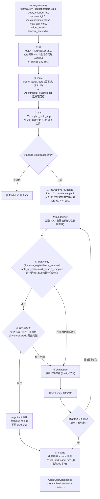

**终止条件**：`max_steps`（默认 8，`len(steps) >= max_steps` 截断，状态 `max_steps`）；总耗时超 `timeout_seconds`（状态 `timeout`，**仅标记不改答案**）；异常（状态 `error`，记录错误 trace）。每个 step 追加时自动推送 `route`/`step` 事件给前端（SSE）。

**重试语义**：final verify 建议重试且 `route.max_retries > 0`，**或空答案**（无视配额强制重试一次）；且 `tool_calls < max_tool_calls` 且 `len(steps) < max_steps`。重试即再调一次 rag.answer，重试后必须重新 verify；二次仍建议重试不再重试（retry_recommended 保留重验结果，trace 不得宣称已验证通过）。空答案重试后仍空 → `degraded_empty_answer` 显式标记 + warning（区分"重试已执行仍空"与"重试被限流没执行"）。

### 4.3 三种作答路径（全部由路由+会话状态自动决定，无用户可选参数）

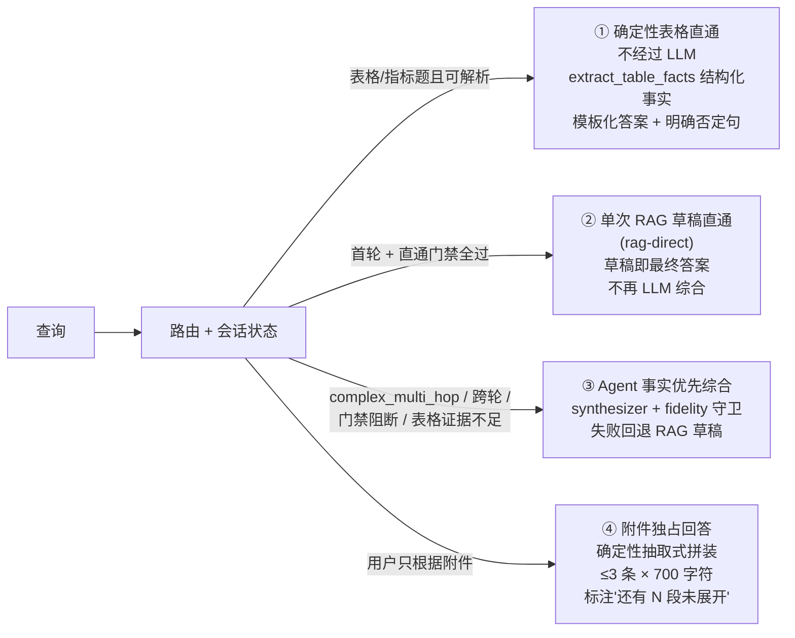

> 前端模式切换只有 `agent`（Agent 模式，SSE 流式）与 `rag`（标准 RAG，同步）两种——后端三种作答路径由路由自动选择，用户不可选（`test_agent_routes.py` 明测请求体无 answer_mode 字段）。

**rag-direct 直通**（2026-08-12 后的主路径）：单轮、非跨轮、draft verify 通过、非证据不足/非空/有引用/非 contradicted/非 partial 覆盖 → 直接以草稿为最终答案，`synth_model="rag-direct"`。设计动机："关闭 LLM 无差别重写压缩精确事实的破坏路径"。**直通被阻断的六种原因**：evidence_insufficient / empty_answer / no_citations / rag_contradicted / draft_verify_retry / coverage_partial。

### 4.4 答案综合（`agent_synthesizer.py`）

- **输入**：query、route、conversation_summary、rag_answer、citations、evidence_pack（可选）、InferenceTarget、narrow_context。
- **证据组织**（prompt 三块区）：① Citation excerpts（`[i] 标题: 摘录`，引用索引仅此有效）；② Canonical table facts（`table= label= row= column= value= unit= term= fact_id=`，最多 128 条，附表号→human 标签图例）；③ Evidence pack items（最多 10 条、每条 300 字符，标签 `[idx] doc= kind= stage= hint=`，**显式声明是检索元数据不是引用索引**）。`narrow_context=True`（跨轮）时省略第③块。
- **provider**：`AGENT_SYNTHESIS_PROVIDER`（默认 auto）→ external_api（`EXTERNAL_API_ENABLED`+key，OpenAI 兼容）/ local（generate_chat）/ ollama（generate_structured 结构化 SynthesisPayload）。失败一律安全回退 RAG 草稿（provider=local、model=local-fallback）。
- **引用**：模型写 `[n]`（zero-based）；`_sanitize_inline_citations` 删越界标记；`_extract_cited_indexes` 提取；executor 按 cited_indexes **过滤未引用的 citation 并重排号**（`_retarget_citation_markers`）——正文标记与响应元数据一一对应。
- **事实优先三层机制**：
  1. **prompt 精度规则**：evidence-heavy 路由强制保留每个数值+单位原样、保留缩写/模型名/表号/行列名、缺失显式声明；
  2. **覆盖度重试**（`_should_retry_for_coverage`，仅 evidence_required/table_or_metric/multi_source_compare 且 evidence_pack 非空）：提取通用证据锚点（数值+单位、2-5 位大写缩写，最多 10 个），覆盖 <50% 才重试，每次最多 1 次，锚点列表 ≤12 个写进重试 prompt；
  3. **fidelity 守卫**（provider-uniform，任一失败整体回退 RAG 草稿）：draft-fidelity（合成丢草稿已覆盖的锚点）、新数字打回（出现证据不支持的数值，float 等价比较，"80" 与 "80.5" 视为不同）、表号保留（删证据中的 Table N 即回退）、期望 facts 遗漏（问题+inventory 解析目标表/行/列，与已返回 facts 做 `document_id|parse_version|table_id|row|column` 精确匹配，draft 有而合成没有才触发）。
- **不确定表达**：prompt 强制"evidence 不足时明确说出什么不能确立"；中文结构要求 `## 结论 / ## 证据 / ## 不确定性` 三节（前端按标题渲染色条）；推断须显式标记（推测/推断/基于证据的解读）；外部综合空答案文案 "The current knowledge base did not return enough relevant evidence to answer this question reliably."

### 4.5 验证器（`answer_verifier.py`）——纯确定性规则，无 LLM

1. 空答案 → 警告+建议重试；
2. evidence 类路由（evidence_required/multi_source_compare/table_or_metric）无 citations → 警告+重试；
3. table_or_metric 且答案无数值/单位模式且无 page_kind=="table" 引用 → 警告+重试；
4. 文本质量启发式：相同 4-gram 出现 ≥4 次（复读机信号，纯数字 4-gram 豁免避免误报表格）、单 token ≥8 次且占比 ≥50%（噪音）、<12 token 不统计。

`ok` 恒为 True（验证器永不失败，产物是 warnings/retry_recommended）。另外 RAG 侧 `verification_status`（local-only/contradicted，高风险问题外部验证）作为直通门禁输入，`contradicted` 直接阻断直通。

### 4.6 模型路由（`agent_model_router.py`）——极简

`AgentModelRouter.select(route)` 纯配置映射：`needs_clarification` → `InferenceTarget(profile="none", ...)`（不调用生成模型）；**其余所有路由统一** `profile="generation"` + `OLLAMA_GENERATION_BASE_URL/MODEL/CONTEXT_LENGTH`。即当前只有单一生成目标（综合的模型选择在 synthesizer 内，ollama_synthesis_model 可覆盖）。`target` 记录进 trace；executor 在调用 synthesize 前用 `ModelRuntime.acquire("generation")` 包租约（排队事件 `queue` 实时上报）。

### 4.7 提示词管理（`prompt_rules.py`）——draft 与 synthesize 共用防漂移

- `language_rule`：中文问题 → 简体中文（术语原样）；英文 → 英文；
- `METADATA_BAN_RULE`：禁止输出内部元数据（提交 ID/作者地址/日期/版本号/文档 ID/页码），除非问题明确问且证据原文出现；引用只用 [0] 标记；
- `INFERENCE_MARKING_RULE`：超出证据的推断显式标记；
- `LATEX_FREE_RULE`：公式/力场术语写 Unicode（χ₁、Ala₃、≤），禁止 LaTeX 源；
- `answer_structure_rule`：长答案用 `## 结论`/`## 证据`/`## 不确定性` 固定标题分块（前端按标题渲染）。

synthesizer 另有合成专属 system prompt（"综合而非重复 RAG 草稿"、同语言、只引 [n]）+ 路由级 `_precision_rules`。

### 4.8 会话与记忆（`conversation_memory.py`）

- **存储**：`conversation_sessions`（owner/project/document 范围/expires_at）+ `conversation_turns`（每行一轮：role user/agent/tool、content、tool_name/args/result、step_type、citations）。
- **每轮执行**：touch_session 刷新 TTL（`AGENT_CONVERSATION_TTL_DAYS=30` 天，活跃自动顺延）→ add_turn(user_query) → **轮次压缩**（超 `AGENT_MAX_CONVERSATION_TURNS=200` 删最旧轮，压缩后轮次索引单调递增不复用）→ 检索/工具轮次 add_turn(role=tool, 含 citations 命中文档) → finalize add_turn(role=agent, 答案前 4000 字符 + citations)。
- **并入上下文**：synthesize 时 `_build_conversation_summary`（最近 10 轮 user/agent 各截 200 字符，最后 6 条拼为文本）作 conversation_summary；检索侧 `_contextualize_retrieval_query` 对 **≤30 字符短查询**拼接"上一轮问题：X\n当前追问：Y"（长查询不包装防污染）；**跨轮判定**（第 2 轮起）决定走 synthesize/narrow_context。
- 多租户按 owner_user_id 隔离；会话**不可改绑**项目/文档（改绑 409）；`purge_expired_sessions`/`delete_session`（级联删附件→trace→turns→sessions）。

### 4.9 工具注册（`tool_registry.py`）——4 个内置只读工具

| 工具 | 超时 | 说明 |
|---|---|---|
| `rag.retrieve_evidence` | 120s | 检索不生成：status/items/table_facts/inventory/coverage_status/coverage_missing_tables |
| `rag.answer` | 120s | 完整 RAG 回答：answer_markdown/citations/verification_status |
| `answer.synthesize` | 120s | ctx 有 event_sink 时流式（token/citation 事件），否则非流式 |
| `answer.verify` | 5s | 确定性校验 |

`call_tool` 先按 input_schema（JSON Schema 子集）校验，失败返回结构化 `{ok: False, error, error_type: ToolSchemaError}` 不抛异常；执行异常归类 `ToolExecutionError`。side_effect_level 全为 "none"（**只读安全**）。

### 4.10 trace 存储（`agent_trace_store.py`）——可审计 + 测评数据源

- 表：`agent_trace_runs`（request_id/session_id/project_slug/query/constraints/route/final_answer/citations/warnings/status/latency_ms/provider/model/token 用量/tool_calls/step_count/owner_user_id）+ `agent_trace_steps`（step_id/step_type/summary/latency_ms/tool_name/tool_ok/metadata_json）。
- **密钥永不落库**：序列化递归脱敏（键名命中 api_key/authorization/bearer/token/secret/password/credential/provider_response/raw_response → `[redacted]`；值启发式：sk- 前缀、key=长 token；白名单保留 first_token_ms/prompt_tokens/completion_tokens/tokens_per_second）。
- created_at 强制单调 +1 微秒防分页并列；按 `AGENT_TRACE_RETENTION_DAYS=30` 清理（先 steps 再 runs）；多租户按 owner 过滤。
- 门禁结果全落 metadata（draft_verification/final_verification/direct_block_reason/rag_verification_status/coverage_status/expected_facts_status/degraded_empty_answer）——审计与测评（status/provider/model/usage 过滤统计）都从这里来。

### 4.11 流式输出（`/api/agent/query/stream` SSE）

事件流：`start` → `heartbeat`（每 15s 无事件补发，防代理断连；`X-Accel-Buffering: no` 防 nginx 缓冲）→ `route` → `step`（工具步骤实时追加）→ `queue`（模型排队位置）→ `token`（逐 token delta + model）→ `citation`（引用 index）→ `warning` → `final`（富化 trace_id/provider/model/tool_names/step_summary）→ `error` → `done`。

阻塞执行放工作线程（独立 DB session）；客户端断连 → cancel_event 置位 → ModelRuntime 队列中的请求立即取消，合成循环中抛错回退草稿（最多等 2s 收尾）。

---

## 5. API 层（FastAPI）

路由装配（`main.py`）：`/api`（业务 routes）、`/api/agent`、`/api/quality`、`/api/auth` 四个 router。除 `/api/auth` 外全部挂 `Depends(require_business_api_user)`（认证启用时要求登录，未启用匿名放行）。**无 CORS 中间件**——前端由 API 自身同源提供（`/` 返回 index.html、`/assets` 挂 static），经 Tunnel 也同源。

### 5.1 端点全清单

**认证组**（无需登录）：

| 方法/路径 | 用途 |
|---|---|
| GET `/api/auth/status` | 前端启动探测认证开关与配置完整性 `{enabled, configured}` |
| GET `/api/auth/login` | 307 重定向飞书授权页，写 HttpOnly state Cookie；未配置 503 |
| GET `/api/auth/callback` | 授权回调：校验 state → 换 token → 拉用户 → 租户白名单 → 写会话 Cookie → 307 回 `/` |
| GET `/api/auth/me` | 当前用户信息；未登录 401 |
| POST `/api/auth/logout` | 注销（需 `X-CSRF-Token` 头） |

**业务组**：

| 方法/路径 | 用途/要点 |
|---|---|
| GET `/api/health` | 健康检查：模型就绪度 + 队列/模型运行时快照 |
| GET/POST `/api/projects` | 项目列表（倒序）/ 创建（按 slug 幂等） |
| DELETE `/api/projects/{slug}` | 删项目及全部关联数据；**query 必填 confirm_slug 防误删** |
| POST `/api/ingest/upload` | 上传触发摄取：multipart file + project_slug/project_name；413 超限；注册后入队 `run_document_ingestion` |
| GET `/api/documents` / `GET` `DELETE /api/documents/{id}` | 文档列表（按项目过滤）/ 摘要 / 删除（query 必填 project_slug 校验归属） |
| GET `/api/documents/{id}/source` | 源文本视图：raw_preview + markdown 正文 + 分块列表 + 源文件元信息 |
| GET `/api/documents/{id}/quality` | 质量统计（chunk 数） |
| GET `/api/documents/{id}/file` | 内联返回原始文件（归属校验） |
| GET `/api/documents/{id}/citations/{chunk_id}/location` | 引用块源定位（pdf `#page=N` / docx `#paragraph=` / html `#element/#selector/#xpath` / text `#line=N` + 规范化 source_spans） |
| GET `/api/documents/{id}/parse` | 活动解析版本状态/质量/进度/修复页/警告数/是否可下载 |
| GET `/api/documents/{id}/parse/markdown` | 浏览器查看规范 Markdown（超 10MiB 413） |
| GET `/api/documents/{id}/parse/download` | 流式下载 canonical.md 快照（SpooledTemporaryFile 防并发改动） |
| GET `/api/pipeline/dashboard` | 流水线看板聚合：topics（项目聚合）+ runs（每文档最新运行）+ totals |
| GET `/api/runs` | 流水线运行列表（按项目过滤） |
| GET `/api/reviews` | 评审项列表（实现为 GET） |
| POST `/api/query` | **标准 RAG 问答**：`{project_slug, question, save_answer=true, document_id?}` → QueryResponse |

**Agent 组**：

| 方法/路径 | 用途/要点 |
|---|---|
| POST `/api/agent/query` | 同步 Agent 查询；`AGENT_ENABLED=false`→503；会话跨项目/跨文档 409、他人会话 404 |
| POST `/api/agent/query/stream` | SSE 流式（事件见 4.11） |
| GET `/api/agent/traces` / `GET .../{trace_id}` | 轨迹列表（session/project/status/provider/route 过滤）/ 单条+步骤 |
| GET `/api/agent/sessions` | 会话列表（最新优先；不传 document_id 只返回项目级会话） |
| GET `/api/agent/sessions/{id}/turns` | 会话轮次（作用域/归属不匹配一律 404） |
| DELETE `/api/agent/sessions/{id}` | 硬删会话（含轮次） |
| POST/GET/DELETE `/api/agent/sessions/{id}/attachments[...]` | 会话级临时附件（不生成 Project Document） |

**质量组**：GET `/api/quality/dashboard` —— 纯只读看板，汇总 `QUALITY_REPORTS_DIR` 下 loop 运行 manifest 摘要，**绝不启动 loop 脚本**；副产物只从 run_dir 读取（杜绝任意文件读取）。

### 5.2 认证流程（飞书 OAuth 2.0 + PKCE + Cookie Session，非 JWT）

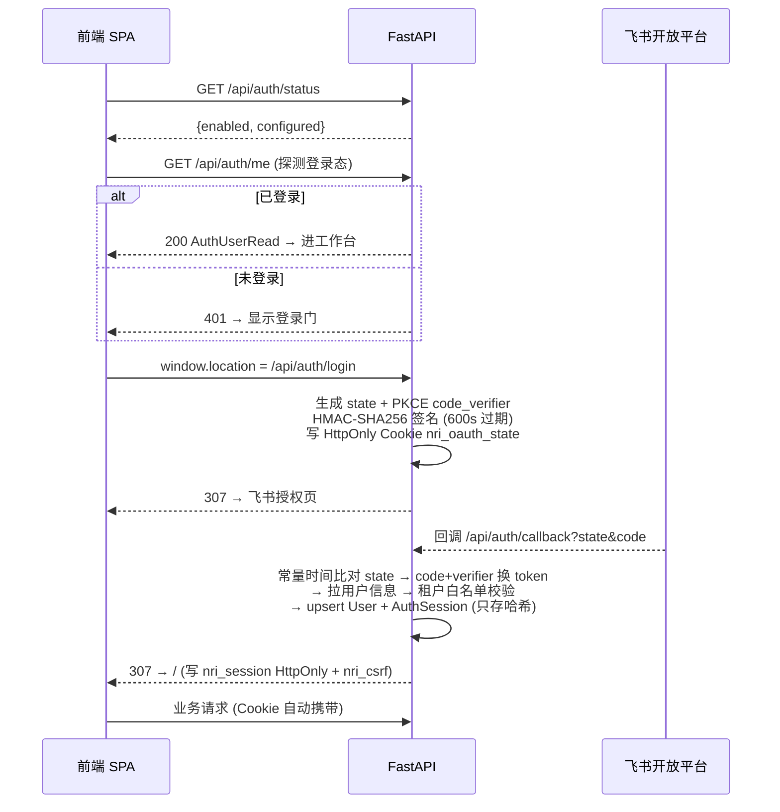

要点：
- **登录态完全靠 Cookie**（无 localStorage/Authorization 头）：`nri_session`（HttpOnly）+ `nri_csrf`（非 HttpOnly）+ `nri_oauth_state`（登录中转）；会话默认 7 天（`AUTH_SESSION_MAX_AGE_SECONDS=604800`）；Cookie 默认 Secure + SameSite=lax。
- **CSRF**：`/api/auth/logout` 双通道校验——`X-CSRF-Token` 头 == `nri_csrf` Cookie 值，且其哈希与会话记录匹配（`hmac.compare_digest` 常量时间）。
- **401 拦截**：前端 `fetchJson` 统一处理——401 且 URL 非 `/api/auth/` 前缀 → 全屏登录门"登录状态已失效，请重新使用飞书登录"。
- **会话作用域隔离**：登录用户只能读/复用/删自己的会话（他人会话按 404 防泄露）；会话跨项目/跨文档作用域复用被拒（409/404）。

### 5.3 安全设计汇总

- 原始文件/规范产物读取：符号链接拒绝 + `O_NOFOLLOW` + fstat 常规文件 + (dev, ino) 身份比对 + SHA-256 指纹复核（manifest/checkpoint 双约束）。
- 删除文档/项目需显式 `confirm_slug`/`project_slug` 归属校验。
- 认证令牌只存 SHA-256 哈希；trace 递归脱敏（见 4.10）。

---

## 6. 前端（单文件原生 JS SPA，无框架无构建）

`src/app/static/index.html`（约 3700 行）：两栏布局——左侧 sidebar（品牌"夜航研究所" + 导航：新聊天/文档库/运行 + 历史会话列表 + 账号区），右侧 main（topbar：视图标签、项目切换、健康状态 pill + 三视图）。hash 路由：`#chat` / `#files` / `#runs`。

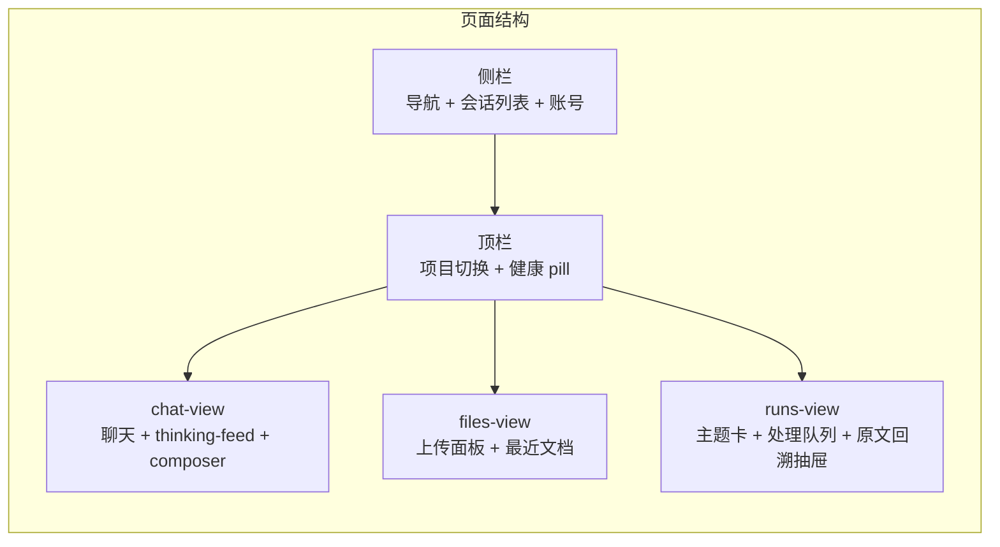

### 6.1 上传流程（files-view）

1. topic 选择下拉（已有项目或 "+ New topic" 填 slug/name）→ 文件选择（`accept=".pdf,.txt,.md,.doc,.docx"`）→ `#uploadForm` submit。
2. 前端 `FormData` → `POST /api/ingest/upload?project_slug=&project_name=`。
3. 成功 → 切换活动项目 → 并行刷新 projects/documents/dashboard/sessions → `setView("runs")` 自动跳转运行看板。

**如实说明的三个口径**：① 上传控件文案"单个文件 ≤ 200MB"与后端 `MAX_UPLOAD_BYTES=50MiB` 不一致（后端 413 为准）；② 视觉上"点击或拖拽"但**没有拖拽事件监听**，实际仅点击选择；③ **每次只取第一个文件**（`files[0]`），不支持多选批量上传。

**状态刷新无自动轮询**：前端没有任何 setInterval/setTimeout/EventSource 轮询——全部动作驱动（切视图/上传后/项目切换/手动点"刷新"按钮）。文档处理进度需手动刷新看板查看（后端 `_parse_progress` 按 8 阶段算百分比）。

### 6.2 问答聊天（chat-view）

- composer：`#queryMode` 下拉（**仅 agent / rag 两种**）+ 附件按钮 + 输入框 + 发送/停止按钮。
- **Agent 模式**：`fetch POST /api/agent/query/stream`（AbortController 支持"停止生成"）→ `response.body.getReader()` 手写 SSE 解析。事件处理：`start`→"正在分析…"；`route`→记录推理模型元信息 + thinking feed；`step`→`appendThinking` 实时追加工具步骤；`queue`→排队面板（模型名+前方位置）；`token`→累积 `streamedAnswer`；`citation`→按 index 存 `streamedCitations`；`final`→富化响应整体渲染；`error`→抛错。**token 事件只累积不逐字渲染（无打字机效果），答案在 final 后整体渲染**。
- **标准 RAG**：`POST /api/query`（save_answer=true）→ `showAnswer`。
- **附件**：`#attachmentButton` 多选 → 每个文件 `POST /api/agent/sessions/{id}/attachments`（会话不存在自动创建）；附件条 chips 可删。
- **会话**：侧栏 `GET /api/agent/sessions`（文档作用域只列文档级）→ selectSession 并行拉 turns + attachments，`role==="agent"` 的 turn 逐个重渲染答案卡；"新聊天"生成 `sess-xxx` 会话 ID。

### 6.3 答案渲染与引用溯源

- **预处理**：`latexToReadable`（`\mathrm{}`、上下标、希腊字母 → Unicode）；`splitAnswerBlocks` 按 `##` 标题切块 → `classifyAnswerHead` 分类 conclusion/evidence/uncertainty/sources/generic（不同样式）。
- **渲染子集**：粗体、列表、段落 + **`[N]` 引用标记 → 可点击 sup 上标**（点击调 `openCitationLocation`）。**不支持表格渲染**（手写 markdown 子集渲染器）。
- **来源区**：按 document_id/attachment_id+title+chunk_id 去重；带 chunk 的渲染为可点击溯源按钮（含 page_label），有 document_id 的渲染为新窗口链接（`/api/documents/{id}/file?project_slug=`）。
- **引用定位**：跳转 runs 视图 → `openSource(document_id)`（并行拉 `/source` + `/parse`）→ `GET .../citations/{chunk_id}/location` → `highlightSourceSpans`：PDF iframe 切到 `#page=N`，有 normalized_bbox 时画百分比定位高亮框；有 line 区间时 canonical markdown 面板高亮滚动；figure 类引用显示"图像分析（非原文文本）"。
- **原文回溯抽屉**：PDF iframe（非 PDF 用 markdown 面板）+ chunk 浏览器（前 100 个可展开"显示全部"）+ 解析状态面板（stage/percent/parser/质量/修复页/警告数）+ "M" 按钮查看 canonical Markdown（按 source_spans 高亮）+ "↓" 下载 canonical.md。

---

## 7. 测评体系与质量门禁

### 7.1 三层质量体系

| 层 | 工具 | 内容 |
|---|---|---|
| 单元/集成 | pytest（2147 个） | 全模块覆盖：流水线/检索/Agent/认证/前端 API/部署脚本 |
| 内部回归 | 30 题 Agent 全量评估（`scripts/evaluate_agent_full.py` + `runtime/task15/internal-research-overlap30-full-answer-cases.json`，打 `/api/agent/query`） | 30/30 全通过（8/18-19 及 8/24 复测）；SciFact 300 条 claim 评测脚本 |
| 公开基准 | SciFact | nDCG@10 0.8503、Recall@10 0.9437（0 未召回） |

### 7.2 质量看板 API

`GET /api/quality/dashboard?limit=5`：递归扫描 `QUALITY_REPORTS_DIR`（默认 ./tmp）下所有 `manifest.json`，按 mtime 倒序返回。每条 RunSummary 含：run_id/overall_status/command_statuses（命令名/退出码/耗时）/mineru_smoke_summary/service_ingest_summary/failed_cases（最多 10 条非 pass）/agent_metrics（查询计数、失败归因、检索覆盖率、表格证据用例、工具/提供方调用计数）。

**安全设计**：绝不信任 manifest 内嵌路径，副产物一律只从 manifest 所在 run_dir 读取。

### 7.3 回归循环 runner（`scripts/run_mineru_rag_loop.py`）

三种 profile（quick/query/full）决定 pytest 命令组合；可选附加命令：
- `--run-mineru-smoke`：跑 `mineru_parser_smoke.py`；
- `--run-service-ingest-smoke`：**走真实 API 链路**——multipart 上传 PDF → 轮询 `/api/runs` 等 completed → 校验文档状态与 quality 检查项。

30 题内部回归走 `scripts/evaluate_agent_full.py`（打 `/api/agent/query`，case 文件 `runtime/task15/internal-research-overlap30-full-answer-cases.json`），不经过 loop runner。产出 `manifest.json + manifest.md` 到 `tmp/loop_runs/mineru_rag_{时间戳}/`，overall_status 汇总，退出码 0/1。

---

## 8. 配置总表（`core/config.py`，env 名 = 字段别名，`.env` 加载，`get_settings()` lru_cache 单例）

| 分组 | 关键环境变量 | 默认 | 用途 |
|---|---|---|---|
| 应用 | `APP_NAME`/`APP_ENV`/`APP_HOST`/`APP_PORT` | Knowledge Agent / development / 0.0.0.0 / 8000 | 基础 |
| DB/队列 | `DATABASE_URL` / `REDIS_URL` / `QUEUE_JOB_TIMEOUT` | sqlite:///./data/app.db / None / 9000s | DB；Redis 无则队列退化为同步直调 |
| 数据目录 | `DATA_DIR`/`RAW_DIR`/`CACHE_DIR`/`CANONICAL_ARTIFACTS_DIR` / `CANONICAL_PIPELINE_VERSION` / `MAX_UPLOAD_BYTES` | ./data… / canonical-v4 / 50MiB | 文件布局与版本前缀 |
| 语义分块 | `SEMANTIC_SPLITTING_ENABLED` / `_MODEL` / `_BREAK_PERCENTILE` / `PARENT_MIN/TARGET/MAX` / `CHILD_MIN/TARGET/MAX` / `CHILD_OVERLAP_TOKENS` / `TOKENIZER_NAME/REVISION` | true / qwen3-embedding:4b / 20 / 500-1200-1800 / 180-400-600 / 50 / Qwen3-Embedding-4B | 分块粒度（校验 min≤target≤max、overlap<min） |
| Ollama 生成 | `OLLAMA_GENERATION_BASE_URL` / `_MODEL` / `_CONTEXT_LENGTH` / `_PARALLELISM` / `_REQUEST_TIMEOUT` / `_KEEP_ALIVE` | 11435 / qwen3.5:9b / 32768 / 1 / 180 / None | 生成运行时 |
| Ollama 嵌入 | `OLLAMA_EMBEDDING_BASE_URL` / `_MODEL` / `_DIMENSIONS` | 11435 / qwen3-embedding:4b / 2560 | 嵌入（请求硬编码 keep_alive=0） |
| 其他模型 | `OLLAMA_VISION_MODEL` / `OLLAMA_SYNTHESIS_MODEL` / `OLLAMA_BATCH_MODEL` | None/None/qwen3.5:9b | 视觉/综合/批处理覆盖 |
| 上下文化 | `CONTEXTUALIZATION_ENABLED` / `_BATCH_SIZE` / `_MAX_RETRIES` / `_TIMEOUT` / `_MAX_SENTENCES` / `_PROMPT_VERSION` | true / 12 / 2 / 180 / 2 / context-v1 | 策略层白名单当前为空 → 通过性 |
| PDF 解析 | `MINERU_ENABLED`/`MINERU_BIN`/`MINERU_BACKEND`/`MINERU_TIMEOUT` / `DOCUMENT_INTELLIGENCE_ENABLED` / `PDF_RENDER_DPI` / `OCR_FALLBACK_ENABLED` / `FIGURE_ANALYSIS_MODEL`/`FORMULA_ANALYSIS_MODEL` | true / .venv/bin/mineru / pipeline / 3600 / true / 160 / false / qwen3.5:9b | 解析回退链 |
| 向量存储 | `VECTOR_STORE_ENABLED` / `VECTOR_STORE_BACKEND` | true / sqlite-vec | pgvector 后端（PostgreSQL 时） |
| 检索 | `QUERY_MODE` / `SAC_KG_ENABLED` / `DEFAULT_PROJECT_SLUG` | rag / false / internal-research | 查询模式/默认项目；SAC-KG 语义抽取需显式开启并配置生成 provider |
| Agent | `AGENT_ENABLED` / `_MAX_STEPS` / `_MAX_TOOL_CALLS` / `_BUDGET_TOKENS` / `_TIMEOUT_SECONDS` / `_ALLOW_EXTERNAL_NETWORK` / `_MAX_CONVERSATION_TURNS` / `_SYNTHESIS_PROVIDER` / `_CONVERSATION_TTL_DAYS` / `_TRACE_RETENTION_DAYS` / `_STREAM_HEARTBEAT_SECONDS` | true / 8 / 5 / 20000 / 90 / false / 200 / auto / 30 / 30 / 15 | 执行预算与生命周期 |
| 外部 API | `EXTERNAL_API_ENABLED`/`_BASE_URL`/`_KEY`/`_MODEL`/`_TIMEOUT` | 全关 / gpt-4o-mini / 90 | 备选 provider |
| MinIO | `MINIO_ENABLED` + `MINIO_*` | false | 对象存储镜像 |
| 质量 | `QUALITY_REPORTS_DIR` | ./tmp | 看板扫描根 |
| 认证 | `AUTH_ENABLED` / `AUTH_SESSION_SECRET` / `_SESSION_MAX_AGE_SECONDS` / `_STATE_MAX_AGE_SECONDS` / `_COOKIE_SECURE` / `_COOKIE_SAMESITE` | false / None / 604800 / 600 / true / lax | Cookie 会话 |
| 飞书 OAuth | `FEISHU_APP_ID`/`SECRET`/`REDIRECT_URI` / `FEISHU_ALLOWED_TENANT` | 均 None | 登录 |
| 飞书机器人 | `FEISHU_BOT_ENABLED` / `_ALLOWED_CHAT_IDS` / `_INBOX_PROJECT` / `_API_BASE_URL` | false / 空 / feishu-inbox / http://127.0.0.1:8002 | 长连接机器人 |
| Worker | `INGESTION_WORKER_QUEUES` / `INGESTION_WORKER_CONCURRENCY` | （worker 侧） | 队列集合 / 并发（必须 1） |
| 维护 | `MAINTENANCE_MODE_ENABLED` | false | 写请求 503 |

检索核心阈值（MAX_CONTEXTS=8、CANONICAL_TABLE_CONTEXT_LIMIT=24、TABLE_CONTEXT_SCORE_BOOST=40、PAPER_ROUTE_MIN_SCORE=2.0、DRAFT_CONTEXT_TOKEN_BUDGET=6000 等）**硬编码在 search.py 顶部，非 env 可配**。

---

## 9. 端到端时序：用户提问 → 答案

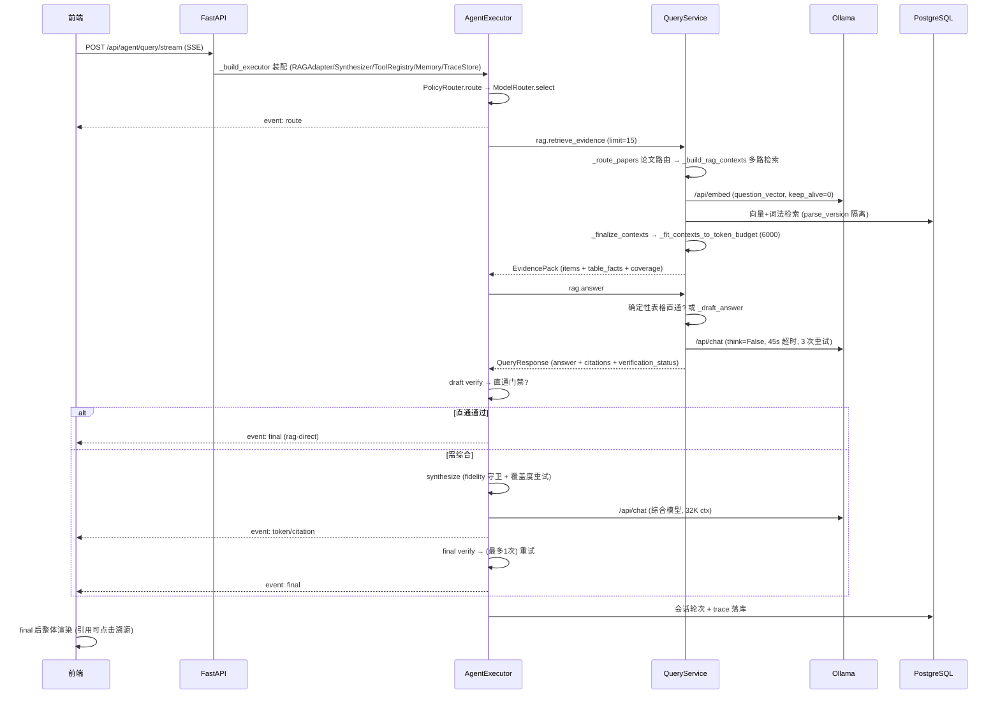

---

## 10. 已知差异与注意事项（如实清单）

1. **前端模式切换只有 agent / rag 两种**——"三种作答模式"是后端路由自动选择（确定性表格/单次RAG/综合），用户不可选。
2. **答案无流式打字效果**——SSE token 事件只累积，final 后整体渲染。
3. **前端无表格渲染**——表格类答案以文本形式展示（手写 markdown 子集）。
4. **文档状态无自动轮询**——手动点"刷新"或切视图。
5. **上传控件**：文案 200MB vs 后端 50MiB；无拖拽监听；仅单文件。
6. **contextualize 阶段当前为通过性**（策略白名单为空）。
7. **BM25/RRF 已下线**（双口径证伪删除）；现役补充路 = 全库向量补充路（R3 守卫）。
8. **`GET /api/reviews`** 模块 docstring 写 POST，实现为 GET（以代码为准）。
9. **检索阈值常量硬编码**于 search.py 顶部，改需要动代码而非配置。
10. **生产目标 nDCG ≥0.86 未最终达成**（当前 0.8503 量级）；词法路表格检索的 +40 特权与 lock 分支仍是文档中提到的主导伤害源之一。
